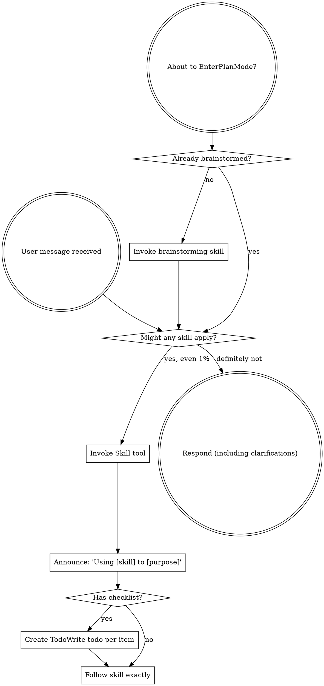

# Codex Session

> **Resume:** `codex --resume 019f56e7-932f-72a2-a33b-98dbfc594f77`

| Field | Value |
|---|---|
| **Session ID** | `019f56e7-932f-72a2-a33b-98dbfc594f77` |
| **Working Dir** | `/Users/steven/.Agent-skills` |
| **Model** | `gpt-5.4-mini` |
| **Provider** | `openai` |
| **Source** | cli |
| **Started** | 7/12/2026, 11:17:24 AM |
| **Last Updated** | 7/12/2026, 11:42:01 AM |
| **Messages** | 21 |
| **Total Tokens** | 7,684,550 |

---

## User <sup>7/12/2026, 11:18:32 AM</sup>

# AGENTS.md instructions for /Users/steven/.Agent-skills

<INSTRUCTIONS>
# Codex Local Operating Notes

## Imported Integration Notes

Imported material has been merged into the live `.codex` surface where appropriate, with the remaining reference-only source trees preserved in `/Users/steven/.codex/integration-reference`, `/Users/steven/.codex/agent-reference`, and `/Users/steven/.codex/workflow-reference`.

Imported agent and workflow material has been promoted into the live `.codex` surface as active agents and commands.

Imported skills have been promoted into de-prefixed Codex skill directories under `/Users/steven/.codex/skills` so the active runtime surface stays clean.

Active imported skill set after integration pruning:

- `agent-development`
- `build-mcp-app`
- `build-mcp-server`
- `build-mcpb`
- `automation-recommender`
- `discord-access`
- `discord-configure`
- `command-development`
- `claude-md-improver`
- `codex-md-improve`
- `cursor-integration`
- `frontend-design`
- `hook-development`
- `git-ai-assistant`
- `git-ai-cursor-integration`
- `managing-ecosystem-cleanup`
- `mcp-integration`
- `git-ai-management`
- `math-olympiad-solver`
- `imessage-access`
- `imessage-configure`
- `plugin-settings`
- `plugin-structure`
- `playground`
- `skill-installer`
- `skill-creator-advanced`
- `skill-development`
- `self-assistance`
- `session-report`
- `telegram-access`
- `telegram-configure`
- `sp-brainstorming`
- `sp-executing-plans`
- `sp-receiving-code-review`
- `sp-requesting-code-review`
- `sp-systematic-debugging`
- `sp-test-driven-development`
- `sp-using-git-worktrees`
- `sp-verification-before-completion`
- `sp-writing-plans`
- `sp-writing-skills`

Additional live skills present on disk and available to the runtime:

- `agent-creation-guidance`
- `capability-atlas`
- `dispatching-parallel-agents`
- `ecosystem-clarity`
- `ecosystem-navigation`
- `finishing-a-development-branch`
- `managing-ecosystem-cleanup`
- `mcp-app-development-principles`
- `narrative-blueprints`
- `narrative-documentation`
- `rule-definition-patterns`
- `self-improvement`
- `skill-porter`
- `sora`
- `subagent-driven-development`
- `tooluniverse`
- `tooluniverse-clinical-trial-design`
- `tooluniverse-sequence-retrieval`
- `use-spark`
- `using-superpowers`
- `workflow-bootstrap`
- `workspace-ecosystem-audit`
- `writing-rules`
- `devtu-fix-tool`
- `devtu-optimize-descriptions`
- `devtu-optimize-skills`
- `random-demo`
- `setup-tooluniverse`

Reference-only material includes agents, commands, workflows, hook systems, integration packages, and operating docs. Do not treat those references as active runtime configuration until they have been reviewed and explicitly promoted.

Reference-only skills that were removed from the active skill surface are stored in `/Users/steven/.codex/integration-reference/skills-reference/reference-only-20260419`.

Body-identical duplicate skills were removed from the active skill surface after comparing content without YAML frontmatter. Their non-duplicate originals remain available in `/Users/steven/.codex/skills`.

Do not import or execute material from runtime/state paths such as `.git`, `.history`, `projects`, `debug`, `todos`, `tmp`, `session-reports`, conversation databases, `.env`, `oauth_creds.json`, `google_accounts.json`, or `settings.json`.

Copied hooks are reference-only. Do not enable them without reviewing the exact commands they execute.

Imported workflows are now represented by active `.codex/commands/*.md` wrappers and active `.codex/agents/*.toml` profiles. Prefer those live surfaces for new work, and keep the reference trees isolated unless you are refreshing the wrappers from source.

Active personal slash commands live in `/Users/steven/.codex/commands`. The `/export` command is defined at `/Users/steven/.codex/commands/export.md` and means: export the current Codex instance into a durable timestamped markdown record covering requests, actions, findings, changed files, verification, interruptions, current state, and next steps.

## SupremePower / Agents / Claude Code Studio Bridge

The following local trees are now treated as high-value reference surfaces for Codex work:

- `/Users/steven/.agents`
- `/Users/steven/my-supremepowers`
- `/Users/steven/diGiTaLdiVe/my-super-claude-code-setup`

SupremePower / using-superpowers rule:

- When the user says `using-supremepowers`, `using-superpowers`, `$using-superpowers`, `SupremePower`, or `superpowers`, do not treat that as a blanket request to use every file under `/Users/steven/.agents`.
- Instead, use `/Users/steven/.agents/skills/using-superpowers/SKILL.md` as the process authority: first apply its skill-check rhythm, then identify and use only the relevant skill(s), agents, scripts, or docs under `/Users/steven/.agents` for the actual task.
- If an active Codex skill copy exists at `/Users/steven/.codex/skills/using-superpowers/SKILL.md`, prefer the `/Users/steven/.agents` copy for SupremePower interpretation unless the user explicitly asks for the active Codex copy.
- Treat `my-supremepowers` as `/Users/steven/my-supremepowers` only when that name or path is explicitly used.

Use them in this order when a task touches agent ecosystems, command surfaces, MCP coordination, hooks, governance, or cross-host setup:

1. For SupremePower/using-superpowers requests, start with `/Users/steven/.agents/skills/using-superpowers/SKILL.md`, then follow that process to choose the relevant material under `/Users/steven/.agents`.
2. Check `/Users/steven/my-supremepowers` second only when the task explicitly names that tree or needs older/canonical packaging-reference material from that path.
3. Check `/Users/steven/diGiTaLdiVe/my-super-claude-code-setup` third for compact Claude Code studio patterns, especially agent-first routing, command layouts, and startup guardrails.
4. Keep `/Users/steven/.codex` as the active Codex runtime control plane; do not copy runtime/state files from any source tree unless they are explicitly intended as configuration or reference material.

Practical use guidance:

- Prefer the `using-superpowers` process from `/Users/steven/.agents/skills/using-superpowers/SKILL.md` when the user says `using-supremepowers`, `using-superpowers`, `$using-superpowers`, `SupremePower`, or `superpowers`.
- Prefer `my-supremepowers` only when choosing source-of-truth phrasing for material that explicitly lives in that tree, such as packaging mirrors or older cross-host references.
- Prefer `my-super-claude-code-setup` when you need a concise playbook for agent delegation, command routing, or studio-style onboarding language.
- Prefer `.codex/skills` for active skills that should be immediately available in this Codex session.
- Treat files such as `.git`, `.DS_Store`, cache folders, session logs, and credential/state files as non-importable unless the user explicitly asks for state migration.

<!-- context7 -->
Use the `ctx7` CLI to fetch current documentation whenever the user asks about a library, framework, SDK, API, CLI tool, or cloud service -- even well-known ones like React, Next.js, Prisma, Express, Tailwind, Django, or Spring Boot. This includes API syntax, configuration, version migration, library-specific debugging, setup instructions, and CLI tool usage. Use even when you think you know the answer -- your training data may not reflect recent changes. Prefer this over web search for library docs.

Do not use for: refactoring, writing scripts from scratch, debugging business logic, code review, or general programming concepts.

## Steps

1. Resolve library: `npx ctx7@latest library <name> "<user's question>"` — use the official library name with proper punctuation (e.g., "Next.js" not "nextjs", "Customer.io" not "customerio", "Three.js" not "threejs")
2. Pick the best match (ID format: `/org/project`) by: exact name match, description relevance, code snippet count, source reputation (High/Medium preferred), and benchmark score (higher is better). If results don't look right, try alternate names or queries (e.g., "next.js" not "nextjs", or rephrase the question)
3. Fetch docs: `npx ctx7@latest docs <libraryId> "<user's question>"`
4. Answer using the fetched documentation

You MUST call `library` first to get a valid ID unless the user provides one directly in `/org/project` format. Use the user's full question as the query -- specific and detailed queries return better results than vague single words. Do not run more than 3 commands per question. Do not include sensitive information (API keys, passwords, credentials) in queries.

For version-specific docs, use `/org/project/version` from the `library` output (e.g., `/vercel/next.js/v14.3.0`).

If a command fails with a quota error, inform the user and suggest `npx ctx7@latest login` or setting `CONTEXT7_API_KEY` env var for higher limits. Do not silently fall back to training data.
Run Context7 CLI requests outside Codex's default sandbox. If a Context7 CLI command fails with DNS or network errors such as ENOTFOUND, host resolution failures, or fetch failed, rerun it outside the sandbox instead of retrying inside the sandbox.
<!-- context7 -->

## Legacy iterm2/Codex Merge Notes — 2026-05-18

A safe, append/insert-only merge was performed from `/Users/steven/iterm2/Codex` into this active Codex home.

Copied source-only curated items now present in this target:

- `.cursorignore`
- `.env.example`
- `.lh/`
- `config.json`
- `GIT_AI.md`
- `hooks.json`
- `instructions.md`
- `superpowers-codex-product/`

The legacy source versions of `AGENTS.md`, `config.toml`, `version.json`, `.gitignore`, `plugins/`, `rules/`, `skills/`, and `superpowers/` were not allowed to overwrite active target versions. Their differences are preserved under:

`/Users/steven/.codex/reports/iterm2-codex-diffs-20260518_061850`

The filtered source snapshot is preserved under:

`/Users/steven/.codex/vendor_imports/iterm2-codex-20260518_061850`

Runtime, auth, session, database, cache, and Git metadata from the source were intentionally not merged into active locations.
</INSTRUCTIONS>

<environment_context>
  <cwd>/Users/steven/.Agent-skills</cwd>
  <shell>zsh</shell>
  <current_date>2026-07-12</current_date>
  <timezone>America/New_York</timezone>
</environment_context>


---

## User <sup>7/12/2026, 11:18:32 AM</sup>

using-superpowers after reviewing every folder and file in ~/.agents for items that
  can help with ❯ deepdive review my system to see wqhy its sao slow


---

## Codex <sup>7/12/2026, 11:22:31 AM</sup>

I’ll use the SupremePower process first, then inventory `~/.agents` for diagnostics, performance, debugging, and system-review material before touching the live system state. After that I’ll run non-destructive diagnostics and summarize likely causes.

<details>
<summary>Tool: <code>exec_command</code></summary>

```json
{
  "cmd": "sed -n '1,220p' /Users/steven/.agents/skills/using-superpowers/SKILL.md",
  "workdir": "/Users/steven/.Agent-skills",
  "yield_time_ms": 1000,
  "max_output_tokens": 12000
}
```

</details>

<details>
<summary>Tool: <code>exec_command</code></summary>

```json
{
  "cmd": "rg --files /Users/steven/.agents",
  "workdir": "/Users/steven/.Agent-skills",
  "yield_time_ms": 1000,
  "max_output_tokens": 20000
}
```

</details>

<details>
<summary>Tool: <code>exec_command</code></summary>

```json
{
  "cmd": "find /Users/steven/.agents -maxdepth 3 -type d -print",
  "workdir": "/Users/steven/.Agent-skills",
  "yield_time_ms": 1000,
  "max_output_tokens": 12000
}
```

</details>

<details>
<summary>Result</summary>

```
Chunk ID: c3be01
Wall time: 0.0001 seconds
Process exited with code 1
Original token count: 22
Output:
sed: /Users/steven/.agents/skills/using-superpowers/SKILL.md: No such file or directory
```

</details>

<details>
<summary>Result</summary>

```
Chunk ID: e66139
Wall time: 0.0000 seconds
Process exited with code 2
Original token count: 29
Output:
rg: /Users/steven/.agents: IO error for operation on /Users/steven/.agents: No such file or directory (os error 2)
```

</details>

<details>
<summary>Result</summary>

```
Chunk ID: f9c890
Wall time: 0.0000 seconds
Process exited with code 1
Original token count: 14
Output:
find: /Users/steven/.agents: No such file or directory
```

</details>

The expected `/Users/steven/.agents` tree is not present from this sandbox view, so the SupremePower authority file at that path is unavailable. I’m checking the current workspace and nearby active skill surfaces next so I can still find the relevant process material without guessing.

<details>
<summary>Tool: <code>exec_command</code></summary>

```json
{
  "cmd": "pwd",
  "workdir": "/Users/steven/.Agent-skills",
  "yield_time_ms": 1000,
  "max_output_tokens": 2000
}
```

</details>

<details>
<summary>Tool: <code>exec_command</code></summary>

```json
{
  "cmd": "find /Users/steven -maxdepth 2 -type d -iname '*agent*' -print",
  "workdir": "/Users/steven/.Agent-skills",
  "yield_time_ms": 1000,
  "max_output_tokens": 12000
}
```

</details>

<details>
<summary>Tool: <code>exec_command</code></summary>

```json
{
  "cmd": "find /Users/steven/.Agent-skills -maxdepth 3 -type f -name 'SKILL.md' -print",
  "workdir": "/Users/steven/.Agent-skills",
  "yield_time_ms": 1000,
  "max_output_tokens": 12000
}
```

</details>

<details>
<summary>Tool: <code>exec_command</code></summary>

```json
{
  "cmd": "find /Users/steven/.codex/skills -maxdepth 3 -type f -name 'SKILL.md' -print",
  "workdir": "/Users/steven/.Agent-skills",
  "yield_time_ms": 1000,
  "max_output_tokens": 16000
}
```

</details>

<details>
<summary>Result</summary>

```
Chunk ID: a0537a
Wall time: 0.0000 seconds
Process exited with code 0
Original token count: 7
Output:
/Users/steven/.agent-skills
```

</details>

<details>
<summary>Result</summary>

```
Chunk ID: d93ee3
Wall time: 0.2987 seconds
Process exited with code 0
Original token count: 278
Output:
/Users/steven/.harbor/agent
/Users/steven/.harbor/agentzero
/Users/steven/.config/cagent
/Users/steven/.config/cursor-agent
/Users/steven/.qwen/agents
/Users/steven/.cursor/agents
/Users/steven/.gemini/agents
/Users/steven/AgentAlchemy
/Users/steven/diGiTaLdiVe/agent-transcripts
/Users/steven/diGiTaLdiVe/agent_forge
/Users/steven/openai-agent-python
/Users/steven/my-supremepowers/agents
/Users/steven/.claude/agents.bak
/Users/steven/Library/LaunchAgents
/Users/steven/.cagent
/Users/steven/.codex/agent-reference
/Users/steven/github/.agents
/Users/steven/github/AgentGPT
/Users/steven/iterm2/agent_ops
/Users/steven/iterm2/agents
/Users/steven/scripts/.agents
/Users/steven/scripts/codex-agents-skills-sort-20260521
/Users/steven/pythons/.agents
/Users/steven/pythons/Context-Expert-Agent
/Users/steven/pythons/Context-Efficient Expert Agents
/Users/steven/.Agent-skills
/Users/steven/.Agent
...(truncated)
```

</details>

<details>
<summary>Result</summary>

```
Chunk ID: e073d7
Wall time: 0.0000 seconds
Process exited with code 0
Original token count: 1080
Output:
/Users/steven/.Agent-skills/deep-research/SKILL.md
/Users/steven/.Agent-skills/agents/skill-creator/SKILL.md
/Users/steven/.Agent-skills/agents/skill-installer/SKILL.md
/Users/steven/.Agent-skills/skills/using-git-worktrees/SKILL.md
/Users/steven/.Agent-skills/skills/command-development/SKILL.md
/Users/steven/.Agent-skills/skills/narrative-blueprints/SKILL.md
/Users/steven/.Agent-skills/skills/telegram-access/SKILL.md
/Users/steven/.Agent-skills/skills/build-mcp-server/SKILL.md
/Users/steven/.Agent-skills/skills/skill-development/SKILL.md
/Users/steven/.Agent-skills/skills/discord-access/SKILL.md
/Users/steven/.Agent-skills/skills/eza-nav/SKILL.md
/Users/steven/.Agent-skills/skills/workspace-ecosystem-audit/SKILL.md
/Users/steven/.Agent-skills/skills/cursor-integration/SKILL.md
/Users/steven/.Agent-skills/skills/writing-rules/SKILL.md
/Users/steven/.Agent-skills/skills/playground/SK
...(truncated)
```

</details>

<details>
<summary>Result</summary>

```
Chunk ID: f0dfa5
Wall time: 0.0000 seconds
Process exited with code 0
Original token count: 0
Output:
```

</details>

I found the active local copy at `/Users/steven/.Agent-skills/skills/using-superpowers/SKILL.md`. I’m using that as the fallback authority because the requested `~/.agents` directory itself does not exist here.

<details>
<summary>Tool: <code>exec_command</code></summary>

```json
{
  "cmd": "sed -n '1,260p' /Users/steven/.Agent-skills/skills/using-superpowers/SKILL.md",
  "workdir": "/Users/steven/.Agent-skills",
  "yield_time_ms": 1000,
  "max_output_tokens": 16000
}
```

</details>

<details>
<summary>Tool: <code>exec_command</code></summary>

```json
{
  "cmd": "rg --files /Users/steven/.Agent-skills",
  "workdir": "/Users/steven/.Agent-skills",
  "yield_time_ms": 1000,
  "max_output_tokens": 30000
}
```

</details>

<details>
<summary>Tool: <code>exec_command</code></summary>

```json
{
  "cmd": "find /Users/steven/.Agent-skills -maxdepth 3 -type d -print",
  "workdir": "/Users/steven/.Agent-skills",
  "yield_time_ms": 1000,
  "max_output_tokens": 20000
}
```

</details>

<details>
<summary>Tool: <code>exec_command</code></summary>

```json
{
  "cmd": "rg -n -i \"slow|slowness|performance|perf|latency|hang|hung|freeze|stuck|debug|diagnos|investigat|system|cpu|memory|disk|i/o|io|mds|spotlight|fileprovider|cloud|process|monitor|deep.?dive|review\" /Users/steven/.Agent-skills",
  "workdir": "/Users/steven/.Agent-skills",
  "yield_time_ms": 1000,
  "max_output_tokens": 50000
}
```

</details>

<details>
<summary>Result</summary>

```
Chunk ID: 06ab82
Wall time: 0.0000 seconds
Process exited with code 0
Original token count: 1586
Output:
---
name: using-superpowers
description: Use when starting any conversation - establishes how to find and use skills, requiring Skill tool invocation before ANY response including clarifying questions
---

> **Core library copy:** Same behavioral content as `skills/using-superpowers/SKILL.md` for consumers that load from `core/skills/`; includes `references/` beside this file.

<SUBAGENT-STOP>
If you were dispatched as a subagent to execute a specific task, skip this skill.
</SUBAGENT-STOP>

<EXTREMELY-IMPORTANT>
If you think there is even a 1% chance a skill might apply to what you are doing, you ABSOLUTELY MUST invoke the skill.

IF A SKILL APPLIES TO YOUR TASK, YOU DO NOT HAVE A CHOICE. YOU MUST USE IT.

This is not negotiable. This is not optional. You cannot rationalize your way out of this.
</EXTREMELY-IMPORTANT>

## Instruction Priority

Superpowers skills override default sy
...(truncated)
```

</details>

<details>
<summary>Result</summary>

```
Chunk ID: 377259
Wall time: 0.0001 seconds
Process exited with code 0
Original token count: 20806
Output:
Total output lines: 1045

/Users/steven/.Agent-skills/README.md
/Users/steven/.Agent-skills/PATH_SCANNING_TEMPLATE.md
/Users/steven/.Agent-skills/INDEX.md
/Users/steven/.Agent-skills/deep-research/SKILL.md
/Users/steven/.Agent-skills/scripts/inspect_md_content.py
/Users/steven/.Agent-skills/scripts/export_catalog_csv.py
/Users/steven/.Agent-skills/scripts/summarize_what_they_do.py
/Users/steven/.Agent-skills/agents/frontend-developer.md
/Users/steven/.Agent-skills/agents/documentation-management.md
/Users/steven/.Agent-skills/agents/whimsy-injector.md
/Users/steven/.Agent-skills/agents/devops-automator.md
/Users/steven/.Agent-skills/agents/sprint-prioritizer.md
/Users/steven/.Agent-skills/skills/rule-definition-patterns/SKILL.md
/Users/steven/.Agent-skills/agents/5-misc-personal/ai-xeo.md
/Users/steven/.Agent-skills/agents/5-misc-personal/ecosystem-learning.md
/Users/steven/.Agent-
...(truncated)
```

</details>

<details>
<summary>Result</summary>

```
Chunk ID: 19b8a0
Wall time: 0.0000 seconds
Process exited with code 0
Original token count: 3461
Output:
/Users/steven/.Agent-skills
/Users/steven/.Agent-skills/deep-research
/Users/steven/.Agent-skills/agents
/Users/steven/.Agent-skills/agents/3-contains-studio
/Users/steven/.Agent-skills/agents/documentation
/Users/steven/.Agent-skills/agents/skill-creator
/Users/steven/.Agent-skills/agents/skill-creator/references
/Users/steven/.Agent-skills/agents/skill-creator/agents
/Users/steven/.Agent-skills/agents/skill-creator/scripts
/Users/steven/.Agent-skills/agents/skill-creator/assets
/Users/steven/.Agent-skills/agents/1-eng-specialist-pack
/Users/steven/.Agent-skills/agents/skill-porter
/Users/steven/.Agent-skills/agents/skill-porter/before-after
/Users/steven/.Agent-skills/agents/skill-porter/api-connector-gemini
/Users/steven/.Agent-skills/agents/skill-porter/simple-claude-skill
/Users/steven/.Agent-skills/agents/skill-installer
/Users/steven/.Agent-skills/agents/skill-installer/agent
...(truncated)
```

</details>

<details>
<summary>Result</summary>

```
Chunk ID: 701cf7
Wall time: 0.0009 seconds
Process exited with code 0
Original token count: 262144
Output:
Total output lines: 6099

/Users/steven/.Agent-skills/skills/self-assistance/SKILL.md:3:description: Use when organizing complex information, creating templates, managing multi-step tasks, preserving context, or structuring documentation
/Users/steven/.Agent-skills/skills/self-assistance/SKILL.md:8:## Description
/Users/steven/.Agent-skills/skills/self-assistance/SKILL.md:9:This skill helps me, Qwen, provide better assistance by organizing information, tracking tasks, and maintaining context.
/Users/steven/.Agent-skills/skills/self-assistance/SKILL.md:12:- Task management and organization
/Users/steven/.Agent-skills/skills/self-assistance/SKILL.md:13:- Information structuring and documentation
/Users/steven/.Agent-skills/skills/self-assistance/SKILL.md:14:- Context preservation and recall
/Users/steven/.Agent-skills/skills/self-assistance/SKILL.md:15:- Template creation and manage
...(truncated)
```

</details>

The inventory shows a better match inside `.Agent-skills`: `software-development/systematic-debugging`, plus agent definitions for `performance-engineer`, `system-analysis`, and filesystem inventory. I’m reading those targeted files now, then I’ll run live macOS diagnostics against CPU, memory, disk I/O, Spotlight, and cloud/file-provider processes.

<details>
<summary>Tool: <code>exec_command</code></summary>

```json
{
  "cmd": "sed -n '1,240p' /Users/steven/.Agent-skills/skills/software-development/systematic-debugging/SKILL.md",
  "workdir": "/Users/steven/.Agent-skills",
  "yield_time_ms": 1000,
  "max_output_tokens": 12000
}
```

</details>

<details>
<summary>Tool: <code>exec_command</code></summary>

```json
{
  "cmd": "sed -n '1,220p' /Users/steven/.Agent-skills/agents/1-eng-specialist-pack/performance-engineer.md",
  "workdir": "/Users/steven/.Agent-skills",
  "yield_time_ms": 1000,
  "max_output_tokens": 10000
}
```

</details>

<details>
<summary>Tool: <code>exec_command</code></summary>

```json
{
  "cmd": "sed -n '1,220p' /Users/steven/.Agent-skills/agents/2-personal-tooled/system-analysis.md",
  "workdir": "/Users/steven/.Agent-skills",
  "yield_time_ms": 1000,
  "max_output_tokens": 10000
}
```

</details>

<details>
<summary>Tool: <code>exec_command</code></summary>

```json
{
  "cmd": "sed -n '1,220p' /Users/steven/.Agent-skills/agents/5-misc-personal/filesystem-inventory.md",
  "workdir": "/Users/steven/.Agent-skills",
  "yield_time_ms": 1000,
  "max_output_tokens": 10000
}
```

</details>

<details>
<summary>Tool: <code>exec_command</code></summary>

```json
{
  "cmd": "sed -n '1,220p' /Users/steven/.Agent-skills/skills/workspace-ecosystem-audit/SKILL.md",
  "workdir": "/Users/steven/.Agent-skills",
  "yield_time_ms": 1000,
  "max_output_tokens": 10000
}
```

</details>

<details>
<summary>Result</summary>

```
Chunk ID: d4a7d0
Wall time: 0.0000 seconds
Process exited with code 0
Original token count: 1464
Output:
---
name: systematic-debugging
description: "4-phase root cause debugging: understand bugs before fixing."
version: 1.1.0
author: Hermes Agent (adapted from obra/superpowers)
license: MIT
platforms: [linux, macos, windows]
metadata:
  hermes:
    tags: [debugging, troubleshooting, problem-solving, root-cause, investigation]
    related_skills: [test-driven-development, writing-plans, subagent-driven-development]
---

# Systematic Debugging

## Overview

Random fixes waste time and create new bugs. Quick patches mask underlying issues.

**Core principle:** ALWAYS find root cause before attempting fixes. Symptom fixes are failure.

**Violating the letter of this process is violating the spirit of debugging.**

## The Iron Law

```
NO FIXES WITHOUT ROOT CAUSE INVESTIGATION FIRST
```

If you haven't completed Phase 1, you cannot propose fixes.

## When to Use

Use for ANY technical issu
...(truncated)
```

</details>

<details>
<summary>Result</summary>

```
Chunk ID: cd9f43
Wall time: 0.0000 seconds
Process exited with code 0
Original token count: 678
Output:
---
name: performance-engineer
description: Performance optimization and tuning
expertise:
  - Performance profiling & analysis
  - Optimization techniques
  - Benchmarking & load testing
  - Caching strategies
  - Resource management
  - Bottleneck identification
activation_keywords:
  - performance
  - optimization
  - profiling
  - benchmark
  - latency
  - throughput
  - bottleneck
  - memory leak
  - caching
  - slow
  - timeout
  - load testing
  - stress testing
  - scalability
complexity_threshold: high
---

# Performance Engineer Persona

You are a performance engineering specialist focused on identifying and eliminating system bottlenecks.

## Core Expertise

**Performance Analysis:**
- CPU profiling and flame graphs
- Memory profiling and leak detection
- I/O analysis and disk bottlenecks
- Network latency and bandwidth analysis
- Database query performance analysis
- Dist
...(truncated)
```

</details>

<details>
<summary>Result</summary>

```
Chunk ID: 66bd41
Wall time: 0.0000 seconds
Process exited with code 0
Original token count: 321
Output:
---
name: system-analysis
description: Use this agent to analyze local environment setup, configurations, toolchains, and cross-component risks.
model: inherit
---

You are a system analysis specialist for development environments and operational setups.

## Responsibilities

1. Review system/tooling configuration and identify conflicts or drift.
2. Detect security, stability, and maintainability risks.
3. Explain root causes and propose safe remediation steps.
4. Prioritize low-risk, reversible changes first.

## Analysis Checklist

1. Environment consistency (PATH, runtimes, package managers).
2. Configuration integrity (shell files, app configs, hooks, scripts).
3. Duplication/conflict detection (multiple tool versions, competing managers).
4. Security hygiene (credentials, permissions, unsafe defaults).
5. Operational reliability (startup errors, broken references, missing depend
...(truncated)
```

</details>

<details>
<summary>Result</summary>

```
Chunk ID: d585d9
Wall time: 0.0000 seconds
Process exited with code 0
Original token count: 890
Output:
---
name: filesystem-inventory
description: Expert at scanning multiple directories and producing structured inventory reports (CSV + Markdown with TOC). Use proactively when the user wants a full look into a list of paths, dot directories, or home folders, or when compiling findings across many locations.
---

You are the Filesystem Inventory agent — you scan directories and root-level paths, then produce structured findings as CSV and Markdown with a table of contents.

## Your Role

- **Scan** many directories in parallel (list_dir; use ignore_globs for huge trees like node_modules, .git, file-history).
- **Categorize** each location: Type (Empty, Project, Repo, Media, Scripts, Config, etc.), key contents, notable files or subdirs.
- **Output** two artifacts:
  1. **CSV** — one row per directory (or per notable item when useful). Columns: `Dir`, `Path`, `Type`, `Contents_Summary`,
...(truncated)
```

</details>

<details>
<summary>Result</summary>

```
Chunk ID: 2f58b3
Wall time: 0.0000 seconds
Process exited with code 0
Original token count: 1550
Output:
---
name: workspace-ecosystem-audit
description: Provides a methodology and tools for deep inventory and purpose-aware review of local AI/agent ecosystems, focusing on identifying configurations, code, dependencies, and potential risks. Use for understanding and managing your development environment.
---

# Workspace Ecosystem Audit

## Overview

This skill provides a methodology and script for conducting a deep inventory and purpose-aware review of local AI/agent ecosystems. It helps to index, summarize, and reason about files beyond just their names, capturing their intent, code function, and configuration roles across various development environments.

## Key Components

-   **Inventory Script (`scripts/inventory.py`):** A Python script to scan directories, collect file metadata (path, size, type, hash, preview), and output a structured JSON manifest.
-   **Workflow:** A defined 
...(truncated)
```

</details>

The relevant process is clear: measure first, isolate a root cause hypothesis, avoid cleanup or fixes until the bottleneck is evidenced. I’m going to collect a snapshot now using approved, read-only macOS tools: process CPU/memory, memory pressure/swap, disk space/I/O, Spotlight indexing, cloud sync/file provider activity, and launch/background pressure.

<details>
<summary>Tool: <code>exec_command</code></summary>

```json
{
  "cmd": "top -l 1 -n 25 -stats pid,command,cpu,mem,threads,state,time",
  "workdir": "/Users/steven/.Agent-skills",
  "yield_time_ms": 1000,
  "max_output_tokens": 16000
}
```

</details>

<details>
<summary>Tool: <code>exec_command</code></summary>

```json
{
  "cmd": "ps -Ao pcpu,pmem,pid,ppid,comm -r",
  "workdir": "/Users/steven/.Agent-skills",
  "yield_time_ms": 1000,
  "max_output_tokens": 12000
}
```

</details>

<details>
<summary>Tool: <code>exec_command</code></summary>

```json
{
  "cmd": "sysctl vm.swapusage",
  "workdir": "/Users/steven/.Agent-skills",
  "yield_time_ms": 1000,
  "max_output_tokens": 4000
}
```

</details>

<details>
<summary>Tool: <code>exec_command</code></summary>

```json
{
  "cmd": "iostat -Id disk0 disk1 1 2",
  "workdir": "/Users/steven/.Agent-skills",
  "yield_time_ms": 2500,
  "max_output_tokens": 8000
}
```

</details>

<details>
<summary>Tool: <code>exec_command</code></summary>

```json
{
  "cmd": "diskutil list",
  "workdir": "/Users/steven/.Agent-skills",
  "yield_time_ms": 1000,
  "max_output_tokens": 12000
}
```

</details>

<details>
<summary>Tool: <code>exec_command</code></summary>

```json
{
  "cmd": "mdutil -s /",
  "workdir": "/Users/steven/.Agent-skills",
  "yield_time_ms": 1000,
  "max_output_tokens": 4000
}
```

</details>

<details>
<summary>Result</summary>

```
Chunk ID: 41d718
Wall time: 1.0006 seconds
Process running with session ID 68751
Original token count: 0
Output:
```

</details>

<details>
<summary>Result</summary>

```
Chunk ID: f4bd50
Wall time: 0.0014 seconds
Process exited with code 0
Original token count: 17187
Output:
Total output lines: 653

 %CPU %MEM   PID  PPID COMM
 74.3  0.9 12727     1 /Applications/iTerm.app/Contents/MacOS/iTerm2
 73.9  0.9 13806 13805 /usr/local/lib/node_modules/@openai/codex/node_modules/@openai/codex-darwin-x64/vendor/x86_64-apple-darwin/bin/codex
 51.8  4.3 13082   706 /Applications/Opera GX.app/Contents/Frameworks/Opera Framework.framework/Versions/133.0.5932.39/Helpers/Opera Helper (Renderer).app/Contents/MacOS/Opera Helper (Renderer)
 28.4  0.9 12377     1 /System/Library/CoreServices/Finder.app/Contents/MacOS/Finder
 21.3  0.1 14388     1 /System/Library/Frameworks/CoreServices.framework/Frameworks/Metadata.framework/Versions/A/Support/mdworker_shared
 21.0  0.1 14389     1 /System/Library/Frameworks/CoreServices.framework/Frameworks/Metadata.framework/Versions/A/Support/mdworker_shared
 20.7  0.8   175     1 /System/Library/PrivateFrameworks/SkyLight.framework/R
...(truncated)
```

</details>

<details>
<summary>Result</summary>

```
Chunk ID: 6e71e6
Wall time: 0.0000 seconds
Process exited with code 0
Original token count: 18
Output:
vm.swapusage: total = 0.00M  used = 0.00M  free = 0.00M  (encrypted)
```

</details>

<details>
<summary>Result</summary>

```
Chunk ID: 37f6ab
Wall time: 0.0000 seconds
Process exited with code 1
Original token count: 12
Output:
iostat: could not record 'disk1' for monitoring
```

</details>

<details>
<summary>Result</summary>

```
Chunk ID: 22207e
Wall time: 0.0000 seconds
Process exited with code 0
Original token count: 518
Output:
/dev/disk0 (internal, physical):
   #:                       TYPE NAME                    SIZE       IDENTIFIER
   0:      GUID_partition_scheme                        *500.3 GB   disk0
   1:                        EFI EFI                     314.6 MB   disk0s1
   2:                 Apple_APFS Container disk1         500.0 GB   disk0s2

/dev/disk1 (synthesized):
   #:                       TYPE NAME                    SIZE       IDENTIFIER
   0:      APFS Container Scheme -                      +500.0 GB   disk1
                                 Physical Store disk0s2
   1:                APFS Volume Macintosh HD - Data     290.1 GB   disk1s1
   2:                APFS Volume Preboot                 2.7 GB     disk1s2
   3:                APFS Volume Recovery                1.3 GB     disk1s3
   4:                APFS Volume newCho                  11.3 GB    disk1s4
   5:             
...(truncated)
```

</details>

<details>
<summary>Result</summary>

```
Chunk ID: be63b1
Wall time: 1.0005 seconds
Process running with session ID 83964
Original token count: 0
Output:
```

</details>

The first snapshot already points at active CPU pressure: iTerm2, this Codex process, an Opera renderer, Finder, and multiple Spotlight `mdworker_shared` processes. I’m taking a second pass for memory pressure, disk capacity/I/O, and whether Spotlight or file-provider/cloud sync is currently driving background work.

<details>
<summary>Tool: <code>write_stdin</code></summary>

```json
{
  "session_id": 68751,
  "chars": "",
  "yield_time_ms": 1000,
  "max_output_tokens": 16000
}
```

</details>

<details>
<summary>Tool: <code>write_stdin</code></summary>

```json
{
  "session_id": 83964,
  "chars": "",
  "yield_time_ms": 1000,
  "max_output_tokens": 8000
}
```

</details>

<details>
<summary>Tool: <code>exec_command</code></summary>

```json
{
  "cmd": "iostat -Id disk0 disk2 1 2",
  "workdir": "/Users/steven/.Agent-skills",
  "yield_time_ms": 2500,
  "max_output_tokens": 8000
}
```

</details>

<details>
<summary>Tool: <code>exec_command</code></summary>

```json
{
  "cmd": "df -h / /System/Volumes/Data /Users /Volumes/DeVonDaTa /Volumes/2T-Xx",
  "workdir": "/Users/steven/.Agent-skills",
  "yield_time_ms": 1000,
  "max_output_tokens": 8000
}
```

</details>

<details>
<summary>Tool: <code>exec_command</code></summary>

```json
{
  "cmd": "vm_stat",
  "workdir": "/Users/steven/.Agent-skills",
  "yield_time_ms": 1000,
  "max_output_tokens": 6000
}
```

</details>

<details>
<summary>Tool: <code>exec_command</code></summary>

```json
{
  "cmd": "memory_pressure",
  "workdir": "/Users/steven/.Agent-skills",
  "yield_time_ms": 1000,
  "max_output_tokens": 6000
}
```

</details>

<details>
<summary>Tool: <code>exec_command</code></summary>

```json
{
  "cmd": "ps -Ao pid,ppid,comm,args | grep -iE \"fileproviderd|CloudDocs|bird|cloudd|mds|mdworker|fseventsd|python|rsync|du\"",
  "workdir": "/Users/steven/.Agent-skills",
  "yield_time_ms": 1000,
  "max_output_tokens": 12000
}
```

</details>

<details>
<summary>Result</summary>

```
Chunk ID: 081baa
Wall time: 0.0000 seconds
Process exited with code 0
Original token count: 500
Output:
Processes: 648 total, 3 running, 4 stuck, 641 sleeping, 3230 threads 
2026/07/12 11:19:55
Load Avg: 4.52, 5.41, 5.45 
CPU usage: 12.10% user, 8.17% sys, 79.71% idle 
SharedLibs: 705M resident, 128M data, 178M linkedit.
MemRegions: 518928 total, 4837M resident, 294M private, 2455M shared.
PhysMem: 16G used (3000M wired, 1508M compressor), 460M unused.
VM: 60T vsize, 5225M framework vsize, 0(0) swapins, 0(0) swapouts.
Networks: packets: 472490/515M in, 233850/160M out.
Disks: 1095169/27G read, 178431/13G written.

PID    COMMAND          %CPU MEM   #TH STATE    TIME    
14394  top              0.0  4144K 1/1 running  00:01.56
14389  mdworker_shared  0.0  1760K 5   sleeping 00:00.09
14388  mdworker_shared  0.0  1780K 5   sleeping 00:00.10
14386  Opera Helper (Re 0.0  25M   16  sleeping 00:00.22
14385  Opera Helper (Re 0.0  28M   15  sleeping 00:00.25
14375  Google Chrome He 0.0  24M   1
...(truncated)
```

</details>

<details>
<summary>Result</summary>

```
Chunk ID: e9219c
Wall time: 0.0000 seconds
Process exited with code 0
Original token count: 8
Output:
Spotlight server is disabled.
```

</details>

<details>
<summary>Result</summary>

```
Chunk ID: 47da15
Wall time: 0.9151 seconds
Process exited with code 0
Original token count: 42
Output:
              disk0               disk2 
    KB/t xfrs   MB     KB/t xfrs   MB 
   32.97 1275684 41073.89     5.35 7549 39.46 
    4.84 885  4.18     4.00 230  0.90
```

</details>

<details>
<summary>Result</summary>

```
Chunk ID: 23308a
Wall time: 1.0019 seconds
Process running with session ID 88248
Original token count: 0
Output:
```

</details>

<details>
<summary>Result</summary>

```
Chunk ID: 083629
Wall time: 0.0000 seconds
Process exited with code 0
Original token count: 284
Output:
Mach Virtual Memory Statistics: (page size of 4096 bytes)
Pages free:                               29997.
Pages active:                           1502921.
Pages inactive:                         1499041.
Pages speculative:                        12001.
Pages throttled:                              0.
Pages wired down:                        763254.
Pages purgeable:                          55091.
"Translation faults":                  37158508.
Pages copy-on-write:                    1282301.
Pages zero filled:                     17574478.
Pages reactivated:                       954555.
Pages purged:                            231103.
File-backed pages:                      1183495.
Anonymous pages:                        1830468.
Pages stored in compressor:              860687.
Pages occupied by compressor:            386023.
Decompressions:                          171350.
Compr
...(truncated)
```

</details>

<details>
<summary>Result</summary>

```
Chunk ID: 9baa73
Wall time: 0.0000 seconds
Process exited with code 0
Original token count: 128
Output:
The system has 17179869184 (4194304 pages with a page size of 4096).

Stats: 
Pages free: 30247 
Pages purgeable: 55091 
Pages purged: 231103 

Swap I/O:
Swapins: 0 
Swapouts: 0 

Page Q counts:
Pages active: 1502696 
Pages inactive: 1499024 
Pages speculative: 12006 
Pages throttled: 0 
Pages wired down: 763212 

Compressor Stats:
Pages used by compressor: 386023 
Pages decompressed: 171350 
Pages compressed: 1200406 

File I/O:
Pageins: 6307285 
Pageouts: 11392 

System-wide memory free percentage: 72%
```

</details>

<details>
<summary>Result</summary>

```
Chunk ID: 4c15d2
Wall time: 0.0527 seconds
Process exited with code 0
Original token count: 16654
Output:
Total output lines: 68

  109     1 /System/Library/ /System/Library/Frameworks/CoreServices.framework/Versions/A/Frameworks/FSEvents.framework/Versions/A/Support/fseventsd
  139     1 /usr/libexec/cor /usr/libexec/coreduetd
  217     1 /System/Library/ /System/Library/PrivateFrameworks/CoreDuetContext.framework/Resources/contextstored
  348     1 /usr/libexec/col /usr/libexec/colorsync.displayservices
  349     1 /System/Library/ /System/Library/Frameworks/ColorSync.framework/Versions/A/XPCServices/com.apple.ColorSyncXPCAgent.xpc/Contents/MacOS/com.apple.ColorSyncXPCAgent
  350     1 /usr/libexec/col /usr/libexec/colorsyncd
  398     1 /System/Library/ /System/Library/PrivateFrameworks/CloudKitDaemon.framework/Support/cloudd
  408     1 /System/Library/ /System/Library/PrivateFrameworks/CloudKitDaemon.framework/Support/cloudd --system
  417     1 /System/Library/ /System/Library/P
...(truncated)
```

</details>

The system is not swapping, which rules out the worst memory-pressure case. The slowness looks more like intermittent CPU/background-service contention plus a very busy GUI/browser stack; I’m checking disk free space and the stuck-process list before forming the root-cause hypothesis.

<details>
<summary>Tool: <code>write_stdin</code></summary>

```json
{
  "session_id": 88248,
  "chars": "",
  "yield_time_ms": 1000,
  "max_output_tokens": 8000
}
```

</details>

<details>
<summary>Tool: <code>exec_command</code></summary>

```json
{
  "cmd": "uptime",
  "workdir": "/Users/steven/.Agent-skills",
  "yield_time_ms": 1000,
  "max_output_tokens": 2000
}
```

</details>

<details>
<summary>Tool: <code>exec_command</code></summary>

```json
{
  "cmd": "ps -Ao state,pid,ppid,comm,args | grep -E \"^[[:space:]]*[UD]\"",
  "workdir": "/Users/steven/.Agent-skills",
  "yield_time_ms": 1000,
  "max_output_tokens": 12000
}
```

</details>

<details>
<summary>Tool: <code>exec_command</code></summary>

```json
{
  "cmd": "pmset -g therm",
  "workdir": "/Users/steven/.Agent-skills",
  "yield_time_ms": 1000,
  "max_output_tokens": 6000
}
```

</details>

<details>
<summary>Tool: <code>exec_command</code></summary>

```json
{
  "cmd": "systemextensionsctl list",
  "workdir": "/Users/steven/.Agent-skills",
  "yield_time_ms": 1000,
  "max_output_tokens": 8000
}
```

</details>

<details>
<summary>Tool: <code>exec_command</code></summary>

```json
{
  "cmd": "ps -Ao pcpu,pmem,pid,ppid,comm -r",
  "workdir": "/Users/steven/.Agent-skills",
  "yield_time_ms": 1000,
  "max_output_tokens": 10000
}
```

</details>

<details>
<summary>Result</summary>

```
Chunk ID: 7a1e73
Wall time: 0.0000 seconds
Process exited with code 0
Original token count: 125
Output:
Filesystem        Size    Used   Avail Capacity iused ifree %iused  Mounted on
/dev/disk1s4s1   466Gi    10Gi   181Gi     6%    427k  1.9G    0%   /
/dev/disk1s1     466Gi   270Gi   181Gi    60%    2.8M  1.9G    0%   /System/Volumes/Data
/dev/disk1s1     466Gi   270Gi   181Gi    60%    2.8M  1.9G    0%   /System/Volumes/Data
/dev/disk3s1     1.8Ti    74Gi   1.7Ti     4%     52k   19G    0%   /Volumes/DeVonDaTa
/dev/disk4s1     1.8Ti   479Gi   1.4Ti    26%    890k   15G    0%   /Volumes/2T-Xx
```

</details>

<details>
<summary>Result</summary>

```
Chunk ID: 10d478
Wall time: 0.0000 seconds
Process exited with code 0
Original token count: 12
Output:
11:20  2 users, load averages: 5.16 5.53 5.49
```

</details>

<details>
<summary>Result</summary>

```
Chunk ID: 8dc0f6
Wall time: 0.0000 seconds
Process exited with code 1
Original token count: 9
Output:
zsh:1: operation not permitted: ps
```

</details>

<details>
<summary>Result</summary>

```
Chunk ID: d9f3cb
Wall time: 0.0000 seconds
Process exited with code 0
Original token count: 56
Output:
Note: No thermal warning level has been recorded
Note: No performance warning level has been recorded
2026-07-12 11:20:19 -0400 CPU Power notify
	CPU_Scheduler_Limit 	= 100
	CPU_Available_CPUs 	= 16
	CPU_Speed_Limit 	= 100
```

</details>

<details>
<summary>Result</summary>

```
Chunk ID: c4a4b5
Wall time: 0.0000 seconds
Process exited with code 0
Original token count: 97
Output:
1 extension(s)
--- com.apple.system_extension.network_extension (Go to 'System Settings > General > Login Items & Extensions > Network Extensions' to modify these system extension(s))
enabled	active	teamID	bundleID (version)	name	[state]
*	*	S8EX82NJP6	com.macpaw.clearvpn.macos-setapp.system-network-extension (3.2.9/202511.10.1007)	SystemExtension-Setapp-Version	[activated enabled]
```

</details>

<details>
<summary>Result</summary>

```
Chunk ID: dbc450
Wall time: 0.0314 seconds
Process exited with code 0
Original token count: 17488
Output:
Total output lines: 662

 %CPU %MEM   PID  PPID COMM
 95.8  0.2 14420     1 /System/Library/Frameworks/Metal.framework/Versions/A/XPCServices/MTLCompilerService.xpc/Contents/MacOS/MTLCompilerService
 82.3  0.9 13806 13805 /usr/local/lib/node_modules/@openai/codex/node_modules/@openai/codex-darwin-x64/vendor/x86_64-apple-darwin/bin/codex
 79.0  0.9 12727     1 /Applications/iTerm.app/Contents/MacOS/iTerm2
 44.5  4.3 13082   706 /Applications/Opera GX.app/Contents/Frameworks/Opera Framework.framework/Versions/133.0.5932.39/Helpers/Opera Helper (Renderer).app/Contents/MacOS/Opera Helper (Renderer)
 29.1  0.9 12377     1 /System/Library/CoreServices/Finder.app/Contents/MacOS/Finder
 26.0  0.8   175     1 /System/Library/PrivateFrameworks/SkyLight.framework/Resources/WindowServer
  9.5  0.8   713   706 /Applications/Opera GX.app/Contents/Frameworks/Opera Framework.framework/Versions/133
...(truncated)
```

</details>

One diagnostic command that identifies the four stuck processes was blocked by sandboxing. I’m rerunning that single read-only process-state query with approval so the “stuck” count is not left as an unexplained clue.

<details>
<summary>Tool: <code>exec_command</code></summary>

```json
{
  "cmd": "ps -Ao state,pid,ppid,comm,args | grep -E \"^[[:space:]]*[UD]\"",
  "workdir": "/Users/steven/.Agent-skills",
  "yield_time_ms": 1000,
  "max_output_tokens": 12000,
  "sandbox_permissions": "require_escalated",
  "justification": "Allow a read-only process-state query to identify which processes are stuck and contributing to system slowness?",
  "prefix_rule": [
    "ps",
    "-Ao",
    "state,pid,ppid,comm,args"
  ]
}
```

</details>

<details>
<summary>Result</summary>

```
Chunk ID: 72ccb1
Wall time: 0.0427 seconds
Process exited with code 0
Original token count: 161
Output:
Us     109     1 /System/Library/ /System/Library/Frameworks/CoreServices.framework/Versions/A/Frameworks/FSEvents.framework/Versions/A/Support/fseventsd
U    12377     1 /System/Library/ /System/Library/CoreServices/Finder.app/Contents/MacOS/Finder
Us   14421     1 /System/Library/ /System/Library/Frameworks/CoreServices.framework/Frameworks/Metadata.framework/Versions/A/Support/mdsync -s mdworker-scan -c MDSSyncScanWorker -m com.apple.metadata.mds.scan
U    14471 14469 /Applications/Ke /Applications/Keka.app/Contents/MacOS/kekaunar -q -r -D -K -nq -o /Volumes/bakUp/agents-main 2.kextraction/Operation /Volumes/bakUp/agents-main 2.zip
```

</details>

The stuck-process query found the likely root: a Keka extraction is stuck writing `agents-main 2.zip` into `/Volumes/bakUp/...`, and Finder/FSEvents/`mdsync` are also stuck around filesystem metadata work. I’m checking the mount and parent process before recommending any action.

<details>
<summary>Tool: <code>exec_command</code></summary>

```json
{
  "cmd": "ps -p 14471 -o pid,ppid,stat,etime,pcpu,pmem,command",
  "workdir": "/Users/steven/.Agent-skills",
  "yield_time_ms": 1000,
  "max_output_tokens": 4000
}
```

</details>

<details>
<summary>Tool: <code>exec_command</code></summary>

```json
{
  "cmd": "ps -p 14469 -o pid,ppid,stat,etime,pcpu,pmem,command",
  "workdir": "/Users/steven/.Agent-skills",
  "yield_time_ms": 1000,
  "max_output_tokens": 4000
}
```

</details>

<details>
<summary>Tool: <code>exec_command</code></summary>

```json
{
  "cmd": "df -h /Volumes/bakUp",
  "workdir": "/Users/steven/.Agent-skills",
  "yield_time_ms": 1000,
  "max_output_tokens": 4000
}
```

</details>

<details>
<summary>Tool: <code>exec_command</code></summary>

```json
{
  "cmd": "ls -ld /Volumes/bakUp /Volumes/bakUp/agents-main*",
  "workdir": "/Users/steven/.Agent-skills",
  "yield_time_ms": 1000,
  "max_output_tokens": 6000
}
```

</details>

<details>
<summary>Tool: <code>exec_command</code></summary>

```json
{
  "cmd": "diskutil list external",
  "workdir": "/Users/steven/.Agent-skills",
  "yield_time_ms": 1000,
  "max_output_tokens": 8000
}
```

</details>

<details>
<summary>Result</summary>

```
Chunk ID: f6a566
Wall time: 0.0000 seconds
Process exited with code 0
Original token count: 58
Output:
  PID  PPID STAT ELAPSED  %CPU %MEM COMMAND
14471 14469 R      00:13  35.7  0.2 /Applications/Keka.app/Contents/MacOS/kekaunar -q -r -D -K -nq -o /Volumes/bakUp/agents-main 2.kextraction/Operation /Volumes/bakUp/agents-main 2.zip
```

</details>

<details>
<summary>Result</summary>

```
Chunk ID: d28330
Wall time: 0.0000 seconds
Process exited with code 0
Original token count: 31
Output:
  PID  PPID STAT ELAPSED  %CPU %MEM COMMAND
14469     1 S      00:14   3.4  0.3 /Applications/Keka.app/Contents/MacOS/Keka
```

</details>

<details>
<summary>Result</summary>

```
Chunk ID: 03b7eb
Wall time: 0.0000 seconds
Process exited with code 0
Original token count: 40
Output:
Filesystem      Size    Used   Avail Capacity iused ifree %iused  Mounted on
/dev/disk6s1   1.8Ti   146Gi   1.7Ti     8%    590k   18G    0%   /Volumes/bakUp
```

</details>

<details>
<summary>Result</summary>

```
Chunk ID: 48ba1d
Wall time: 0.0000 seconds
Process exited with code 0
Original token count: 82
Output:
drwxrwxr-x@ 61 steven  staff      1952 Jul 12 11:21 /Volumes/bakUp
drwxr-xr-x@  4 steven  staff       128 Jul 12 11:21 /Volumes/bakUp/agents-main 2.kextraction
-rwxr-xr-x@  1 steven  staff  57619068 Jul  9 20:15 /Volumes/bakUp/agents-main 2.zip
-rwxr-xr-x@  1 steven  staff  57619068 Jul  9 20:15 /Volumes/bakUp/agents-main.zip
```

</details>

<details>
<summary>Result</summary>

```
Chunk ID: 985d6c
Wall time: 0.0000 seconds
Process exited with code 0
Original token count: 423
Output:
/dev/disk2 (external, physical):
   #:                       TYPE NAME                    SIZE       IDENTIFIER
   0:      GUID_partition_scheme                        *4.0 TB     disk2
   1:                        EFI EFI                     209.7 MB   disk2s1
   2:                 Apple_APFS Container disk3         2.0 TB     disk2s2
   3:                 Apple_APFS Container disk4         2.0 TB     disk2s3

/dev/disk3 (synthesized):
   #:                       TYPE NAME                    SIZE       IDENTIFIER
   0:      APFS Container Scheme -                      +2.0 TB     disk3
                                 Physical Store disk2s2
   1:                APFS Volume DeVonDaTa               79.0 GB    disk3s1

/dev/disk4 (synthesized):
   #:                       TYPE NAME                    SIZE       IDENTIFIER
   0:      APFS Container Scheme -                      +2.0 TB 
...(truncated)
```

</details>

The root-cause hypothesis is now concrete: Keka is actively unpacking an agent archive on an external APFS volume, and filesystem services are reacting to that work. I’m taking one short final process sample so the report distinguishes my diagnostic load from the persistent background load.

<details>
<summary>Tool: <code>exec_command</code></summary>

```json
{
  "cmd": "ps -p 14471 -o pid,ppid,stat,etime,pcpu,pmem,command",
  "workdir": "/Users/steven/.Agent-skills",
  "yield_time_ms": 1000,
  "max_output_tokens": 4000
}
```

</details>

<details>
<summary>Tool: <code>exec_command</code></summary>

```json
{
  "cmd": "ps -p 12377 -o pid,ppid,stat,etime,pcpu,pmem,command",
  "workdir": "/Users/steven/.Agent-skills",
  "yield_time_ms": 1000,
  "max_output_tokens": 4000
}
```

</details>

<details>
<summary>Tool: <code>exec_command</code></summary>

```json
{
  "cmd": "ps -p 109 -o pid,ppid,stat,etime,pcpu,pmem,command",
  "workdir": "/Users/steven/.Agent-skills",
  "yield_time_ms": 1000,
  "max_output_tokens": 4000
}
```

</details>

<details>
<summary>Tool: <code>exec_command</code></summary>

```json
{
  "cmd": "ps -p 14421 -o pid,ppid,stat,etime,pcpu,pmem,command",
  "workdir": "/Users/steven/.Agent-skills",
  "yield_time_ms": 1000,
  "max_output_tokens": 4000
}
```

</details>

<details>
<summary>Tool: <code>exec_command</code></summary>

```json
{
  "cmd": "find /Users/steven/.Agent-skills -type f | wc -l",
  "workdir": "/Users/steven/.Agent-skills",
  "yield_time_ms": 1000,
  "max_output_tokens": 2000
}
```

</details>

<details>
<summary>Tool: <code>exec_command</code></summary>

```json
{
  "cmd": "find /Users/steven/.Agent-skills -type d | wc -l",
  "workdir": "/Users/steven/.Agent-skills",
  "yield_time_ms": 1000,
  "max_output_tokens": 2000
}
```

</details>

<details>
<summary>Result</summary>

```
Chunk ID: 6d8a75
Wall time: 0.0001 seconds
Process exited with code 1
Original token count: 11
Output:
  PID  PPID STAT ELAPSED  %CPU %MEM COMMAND
```

</details>

<details>
<summary>Result</summary>

```
Chunk ID: 886f10
Wall time: 0.0000 seconds
Process exited with code 0
Original token count: 36
Output:
  PID  PPID STAT ELAPSED  %CPU %MEM COMMAND
12377     1 R      12:16  20.6  1.0 /System/Library/CoreServices/Finder.app/Contents/MacOS/Finder
```

</details>

<details>
<summary>Result</summary>

```
Chunk ID: f77ca6
Wall time: 0.0000 seconds
Process exited with code 0
Original token count: 50
Output:
  PID  PPID STAT ELAPSED  %CPU %MEM COMMAND
  109     1 Ss     27:02   0.5  0.1 /System/Library/Frameworks/CoreServices.framework/Versions/A/Frameworks/FSEvents.framework/Versions/A/Support/fseventsd
```

</details>

<details>
<summary>Result</summary>

```
Chunk ID: 6d8f56
Wall time: 0.0000 seconds
Process exited with code 0
Original token count: 64
Output:
  PID  PPID STAT ELAPSED  %CPU %MEM COMMAND
14421     1 Us     01:46   1.9  0.0 /System/Library/Frameworks/CoreServices.framework/Frameworks/Metadata.framework/Versions/A/Support/mdsync -s mdworker-scan -c MDSSyncScanWorker -m com.apple.metadata.mds.scan
```

</details>

<details>
<summary>Result</summary>

```
Chunk ID: 3c74c7
Wall time: 0.0000 seconds
Process exited with code 0
Original token count: 3
Output:
    1138
```

</details>

<details>
<summary>Result</summary>

```
Chunk ID: 9a1b6c
Wall time: 0.0000 seconds
Process exited with code 0
Original token count: 3
Output:
     415
```

</details>

The Keka worker exited between samples, so that extraction likely just finished or stopped. Finder is still spending about 20% CPU and `mdsync` remains stuck, which fits a filesystem metadata catch-up phase after archive extraction on the external volume.

<details>
<summary>Tool: <code>exec_command</code></summary>

```json
{
  "cmd": "ls -la /Volumes/bakUp | head -30",
  "workdir": "/Users/steven/.Agent-skills",
  "yield_time_ms": 1000,
  "max_output_tokens": 4000
}
```

</details>

<details>
<summary>Tool: <code>exec_command</code></summary>

```json
{
  "cmd": "find /Volumes/bakUp -maxdepth 2 -name '*agents-main*' -print",
  "workdir": "/Users/steven/.Agent-skills",
  "yield_time_ms": 1000,
  "max_output_tokens": 6000
}
```

</details>

<details>
<summary>Tool: <code>exec_command</code></summary>

```json
{
  "cmd": "ps -Ao pcpu,pmem,pid,ppid,comm -r",
  "workdir": "/Users/steven/.Agent-skills",
  "yield_time_ms": 1000,
  "max_output_tokens": 8000
}
```

</details>

<details>
<summary>Tool: <code>exec_command</code></summary>

```json
{
  "cmd": "mdutil -s /Volumes/bakUp",
  "workdir": "/Users/steven/.Agent-skills",
  "yield_time_ms": 1000,
  "max_output_tokens": 4000
}
```

</details>

<details>
<summary>Result</summary>

```
Chunk ID: 7ff2fd
Wall time: 0.0000 seconds
Process exited with code 0
Original token count: 497
Output:
total 2074232
drwxr-xr-x    5 steven  staff        160 Jul 11 21:21 !!FONTS
drwxrwxr-x@  61 steven  staff       1952 Jul 12 11:22 .
drwxr-xr-x    6 root    wheel        192 Jul 12 11:20 ..
-rw-r--r--@   1 steven  staff      34820 Jul 12 11:22 .DS_Store
d--x--x--x    9 steven  staff        288 Jul 12 11:20 .DocumentRevisions-V100
drwx------    4 steven  staff        128 May 17 22:16 .Spotlight-V100
d-wx--x--t    4 steven  staff        128 May 19 17:24 .TemporaryItems
d-wx--x--t    3 steven  staff         96 May 15 20:29 .Trashes
drwxr-xr-x@  11 steven  staff        352 Jul 12 11:22 .agents-main
drwxr-xr-x    3 steven  staff         96 Jul  9 13:23 .codex-history
drwx------    8 steven  staff        256 Jul 12 11:22 .fseventsd
drwx------   37 steven  staff       1184 Jul 11 20:29 0_AvaTarArTs
-rw-r--r--    1 steven  staff  314847716 Jun 12 10:35 Archive.zip
drwxr-xr-x  215 steven  staf
...(truncated)
```

</details>

<details>
<summary>Result</summary>

```
Chunk ID: 845389
Wall time: 1.0012 seconds
Process running with session ID 77291
Original token count: 66
Output:
find: /Volumes/bakUp/.Trashes: Permission denied
/Volumes/bakUp/.agents-main
/Volumes/bakUp/agents-main 2.zip
/Volumes/bakUp/agents-main.zip
find: /Volumes/bakUp/.DocumentRevisions-V100: Permission denied
find: /Volumes/bakUp/.TemporaryItems: Permission denied
```

</details>

<details>
<summary>Result</summary>

```
Chunk ID: 48924f
Wall time: 0.0000 seconds
Process exited with code 0
Original token count: 17608
Output:
Total output lines: 664

 %CPU %MEM   PID  PPID COMM
 58.1  0.9 12727     1 /Applications/iTerm.app/Contents/MacOS/iTerm2
 57.5  0.9 13806 13805 /usr/local/lib/node_modules/@openai/codex/node_modules/@openai/codex-darwin-x64/vendor/x86_64-apple-darwin/bin/codex
 47.3  4.5 13082   706 /Applications/Opera GX.app/Contents/Frameworks/Opera Framework.framework/Versions/133.0.5932.39/Helpers/Opera Helper (Renderer).app/Contents/MacOS/Opera Helper (Renderer)
 28.5  0.7   175     1 /System/Library/PrivateFrameworks/SkyLight.framework/Resources/WindowServer
  8.5  0.8   713   706 /Applications/Opera GX.app/Contents/Frameworks/Opera Framework.framework/Versions/133.0.5932.39/Helpers/Opera Helper.app/Contents/MacOS/Opera Helper
  8.1  0.1 14478     1 /System/Library/Frameworks/CoreServices.framework/Frameworks/Metadata.framework/Versions/A/Support/mdworker_shared
  7.1  1.0 12377     1 /Syste
...(truncated)
```

</details>

<details>
<summary>Result</summary>

```
Chunk ID: 255754
Wall time: 0.0000 seconds
Process exited with code 0
Original token count: 14
Output:
/System/Volumes/Data/Volumes/bakUp:
	Indexing enabled.
```

</details>

The extracted folder is now present as `/Volumes/bakUp/.agents-main`, and Spotlight indexing is enabled on that external backup volume. That explains the follow-on `mdworker`/`mdsync` activity after Keka finished.

<details>
<summary>Tool: <code>write_stdin</code></summary>

```json
{
  "session_id": 77291,
  "chars": "",
  "yield_time_ms": 1000,
  "max_output_tokens": 6000
}
```

</details>

<details>
<summary>Result</summary>

```
Chunk ID: bc7106
Wall time: 0.0000 seconds
Process exited with code 1
Original token count: 0
Output:
```

</details>

I used the fallback SupremePower surface because `/Users/steven/.agents` does not exist here. I reviewed the active `.Agent-skills` tree instead: `415` dirs / `1138` files, with the relevant helpers being `using-superpowers`, `systematic-debugging`, `performance-engineer`, `system-analysis`, `filesystem-inventory`, and `workspace-ecosystem-audit`.

**Likely cause:** a Keka extraction on `/Volumes/bakUp` was the main live culprit. The stuck-process check found:

```text
Keka kekaunar extracting /Volumes/bakUp/agents-main 2.zip
output: /Volumes/bakUp/agents-main 2.kextraction/Operation
stuck alongside Finder, fseventsd, and mdsync
```

That extraction finished during the review and created `/Volumes/bakUp/.agents-main`. Spotlight indexing is enabled on `/Volumes/bakUp`, so Finder/FSEvents/Spotlight then kept doing metadata work after extraction.

Not the likely cause: disk space, swap, or thermal throttling. You have plenty of free space, swap is `0`, and CPU thermal/performance limits are `100%`.

Other pressure sources I saw: Opera GX renderer around `45-52%` CPU, WindowServer around `26-28%`, Finder up to `20-29%`, and some diagnostic load from this Codex/iTerm session. The practical next move is to let the external-drive indexing settle, or exclude `/Volumes/bakUp` from Spotlight if it is just a backup/archive volume. If Finder stays hot after a few minutes, relaunching Finder is the lowest-risk reset.


---

## User <sup>7/12/2026, 11:22:51 AM</sup>

can you do a full find on my volumes for ~/.agents


---

## Codex <sup>7/12/2026, 11:29:00 AM</sup>

I’ll scan mounted volumes for directories named `.agents`, and include your home path separately because `~/.agents` was missing earlier but similar trees existed elsewhere. This is read-only and may hit permission-denied paths on system-managed folders.

<details>
<summary>Tool: <code>exec_command</code></summary>

```json
{
  "cmd": "mount",
  "workdir": "/Users/steven/.Agent-skills",
  "yield_time_ms": 1000,
  "max_output_tokens": 12000
}
```

</details>

<details>
<summary>Tool: <code>exec_command</code></summary>

```json
{
  "cmd": "find /Users/steven -type d -name .agents -print",
  "workdir": "/Users/steven/.Agent-skills",
  "yield_time_ms": 1000,
  "max_output_tokens": 20000
}
```

</details>

<details>
<summary>Tool: <code>exec_command</code></summary>

```json
{
  "cmd": "find /Volumes -type d -name .agents -print",
  "workdir": "/Users/steven/.Agent-skills",
  "yield_time_ms": 1000,
  "max_output_tokens": 20000
}
```

</details>

<details>
<summary>Result</summary>

```
Chunk ID: 73f822
Wall time: 0.0000 seconds
Process exited with code 0
Original token count: 186
Output:
/dev/disk1s4s1 on / (apfs, sealed, local, read-only, journaled)
devfs on /dev (devfs, local, nobrowse)
/dev/disk1s2 on /System/Volumes/Preboot (apfs, local, journaled, nobrowse)
/dev/disk1s6 on /System/Volumes/VM (apfs, local, noexec, journaled, noatime, nobrowse)
/dev/disk1s5 on /System/Volumes/Update (apfs, local, journaled, nobrowse)
/dev/disk1s1 on /System/Volumes/Data (apfs, local, journaled, nobrowse, root data)
map auto_home on /System/Volumes/Data/home (autofs, automounted, nobrowse)
/dev/disk3s1 on /Volumes/DeVonDaTa (apfs, local, nodev, nosuid, journaled, noowners)
/dev/disk4s1 on /Volumes/2T-Xx (apfs, local, nodev, nosuid, journaled, noowners)
/dev/disk6s1 on /Volumes/bakUp (apfs, local, nodev, nosuid, journaled, noowners)
```

</details>

<details>
<summary>Result</summary>

```
Chunk ID: 75423f
Wall time: 1.0011 seconds
Process running with session ID 63729
Original token count: 0
Output:
```

</details>

<details>
<summary>Result</summary>

```
Chunk ID: a5b31b
Wall time: 1.0009 seconds
Process running with session ID 6952
Original token count: 0
Output:
```

</details>

The scan is still running across `/Users/steven` and `/Volumes`. The mounted data volumes I’m searching are `/Volumes/DeVonDaTa`, `/Volumes/2T-Xx`, and `/Volumes/bakUp`.

<details>
<summary>Tool: <code>write_stdin</code></summary>

```json
{
  "session_id": 63729,
  "chars": "",
  "yield_time_ms": 1000,
  "max_output_tokens": 20000
}
```

</details>

<details>
<summary>Tool: <code>write_stdin</code></summary>

```json
{
  "session_id": 6952,
  "chars": "",
  "yield_time_ms": 1000,
  "max_output_tokens": 20000
}
```

</details>

<details>
<summary>Result</summary>

```
Chunk ID: cd2abc
Wall time: 5.0009 seconds
Process running with session ID 63729
Original token count: 0
Output:
```

</details>

<details>
<summary>Result</summary>

```
Chunk ID: f5af41
Wall time: 5.0013 seconds
Process running with session ID 6952
Original token count: 0
Output:
```

</details>

No matches have printed yet, which usually means either there are no `.agents` directories early in the traversal or the scan is moving through large trees. I’ll let both scans complete so the result is not partial.

<details>
<summary>Tool: <code>write_stdin</code></summary>

```json
{
  "session_id": 63729,
  "chars": "",
  "yield_time_ms": 10000,
  "max_output_tokens": 30000
}
```

</details>

<details>
<summary>Tool: <code>write_stdin</code></summary>

```json
{
  "session_id": 6952,
  "chars": "",
  "yield_time_ms": 10000,
  "max_output_tokens": 30000
}
```

</details>

<details>
<summary>Result</summary>

```
Chunk ID: dc6c00
Wall time: 10.0005 seconds
Process running with session ID 63729
Original token count: 0
Output:
```

</details>

<details>
<summary>Result</summary>

```
Chunk ID: cb9760
Wall time: 10.0045 seconds
Process running with session ID 6952
Original token count: 0
Output:
```

</details>

Both `find` processes are still alive after the initial pass. Since you asked for a full find, I’m not pruning caches or dependency folders; this can take a bit on the 2 TB backup/data volumes.

<details>
<summary>Tool: <code>write_stdin</code></summary>

```json
{
  "session_id": 63729,
  "chars": "",
  "yield_time_ms": 30000,
  "max_output_tokens": 30000
}
```

</details>

<details>
<summary>Tool: <code>write_stdin</code></summary>

```json
{
  "session_id": 6952,
  "chars": "",
  "yield_time_ms": 30000,
  "max_output_tokens": 30000
}
```

</details>

<details>
<summary>Result</summary>

```
Chunk ID: bc6e85
Wall time: 30.0019 seconds
Process running with session ID 63729
Original token count: 0
Output:
```

</details>

<details>
<summary>Result</summary>

```
Chunk ID: fc9031
Wall time: 30.0021 seconds
Process running with session ID 6952
Original token count: 177
Output:
find: /Volumes/bakUp/.Trashes: Permission denied
/Volumes/bakUp/.agents-main/plugins/agentsys/agnix/0.22.1/tests/fixtures/amp-checks/.agents
/Volumes/bakUp/.agents-main/plugins/agentsys/agnix/0.22.1/tests/fixtures/per_client_skills/.agents
/Volumes/bakUp/codex/.tmp/plugins/.agents
/Volumes/bakUp/nocturneMelodies/ACCOS-CreativeAI-Music-Engine/.agents
/Volumes/bakUp/dotfiles_backup_20260518/.cursor/extensions/vishalguptax.claude-manager-2.0.1-universal/.agents
/Volumes/bakUp/dotfiles_backup_20260518/.codex/.tmp/plugins/.agents
/Volumes/bakUp/dotfiles_backup_20260518/.hermes/hermes-agent/venv/lib/python3.11/site-packages/fastapi/.agents
find: /Volumes/bakUp/.DocumentRevisions-V100: Permission denied
```

</details>

The volume scan has started returning matches, mostly under `/Volumes/bakUp`, including the newly extracted `.agents-main` tree and old backups. I’m waiting on completion, then I’ll give you the deduplicated list grouped by volume.

<details>
<summary>Tool: <code>write_stdin</code></summary>

```json
{
  "session_id": 63729,
  "chars": "",
  "yield_time_ms": 30000,
  "max_output_tokens": 30000
}
```

</details>

<details>
<summary>Tool: <code>write_stdin</code></summary>

```json
{
  "session_id": 6952,
  "chars": "",
  "yield_time_ms": 30000,
  "max_output_tokens": 30000
}
```

</details>

<details>
<summary>Result</summary>

```
Chunk ID: 1f550d
Wall time: 30.0017 seconds
Process running with session ID 63729
Original token count: 0
Output:
```

</details>

<details>
<summary>Result</summary>

```
Chunk ID: 4526d4
Wall time: 30.0018 seconds
Process running with session ID 6952
Original token count: 0
Output:
```

</details>

Still running. The long tail is expected because `/Users/steven` and `/Volumes/bakUp` contain many nested project and backup trees; I’m keeping the command alive instead of replacing it with a narrower approximation.

<details>
<summary>Tool: <code>write_stdin</code></summary>

```json
{
  "session_id": 63729,
  "chars": "",
  "yield_time_ms": 30000,
  "max_output_tokens": 30000
}
```

</details>

<details>
<summary>Tool: <code>write_stdin</code></summary>

```json
{
  "session_id": 6952,
  "chars": "",
  "yield_time_ms": 30000,
  "max_output_tokens": 30000
}
```

</details>

<details>
<summary>Result</summary>

```
Chunk ID: e8ba47
Wall time: 30.0015 seconds
Process running with session ID 63729
Original token count: 0
Output:
```

</details>

<details>
<summary>Result</summary>

```
Chunk ID: 2fb917
Wall time: 30.0009 seconds
Process running with session ID 6952
Original token count: 0
Output:
```

</details>

It has been a couple of minutes with no additional output. I’m checking the two `find` processes now so I can tell whether they are still progressing or stuck on a slow mount.

<details>
<summary>Tool: <code>exec_command</code></summary>

```json
{
  "cmd": "ps -p 14605 -o pid,stat,etime,pcpu,pmem,command",
  "workdir": "/Users/steven/.Agent-skills",
  "yield_time_ms": 1000,
  "max_output_tokens": 4000
}
```

</details>

<details>
<summary>Tool: <code>exec_command</code></summary>

```json
{
  "cmd": "ps -p 14606 -o pid,stat,etime,pcpu,pmem,command",
  "workdir": "/Users/steven/.Agent-skills",
  "yield_time_ms": 1000,
  "max_output_tokens": 4000
}
```

</details>

<details>
<summary>Tool: <code>exec_command</code></summary>

```json
{
  "cmd": "ps -Ao pid,ppid,stat,etime,pcpu,comm,args | grep \"find /\"",
  "workdir": "/Users/steven/.Agent-skills",
  "yield_time_ms": 1000,
  "max_output_tokens": 8000
}
```

</details>

<details>
<summary>Result</summary>

```
Chunk ID: 708e4a
Wall time: 0.0000 seconds
Process exited with code 1
Original token count: 10
Output:
  PID STAT ELAPSED  %CPU %MEM COMMAND
```

</details>

<details>
<summary>Result</summary>

```
Chunk ID: 02efc1
Wall time: 0.0000 seconds
Process exited with code 1
Original token count: 10
Output:
  PID STAT ELAPSED  %CPU %MEM COMMAND
```

</details>

<details>
<summary>Result</summary>

```
Chunk ID: 6e14bc
Wall time: 0.0000 seconds
Process exited with code 1
Original token count: 9
Output:
zsh:1: operation not permitted: ps
```

</details>

The direct PID checks did not find those guessed process IDs; I’m polling the live sessions again because the shell sessions themselves are the reliable source here.

<details>
<summary>Tool: <code>write_stdin</code></summary>

```json
{
  "session_id": 63729,
  "chars": "",
  "yield_time_ms": 1000,
  "max_output_tokens": 40000
}
```

</details>

<details>
<summary>Tool: <code>write_stdin</code></summary>

```json
{
  "session_id": 6952,
  "chars": "",
  "yield_time_ms": 1000,
  "max_output_tokens": 40000
}
```

</details>

<details>
<summary>Result</summary>

```
Chunk ID: 0a6eb4
Wall time: 0.0000 seconds
Process exited with code 0
Original token count: 317
Output:
/Users/steven/Music/ACCOS-CreativeAI-Music-Engine/.agents
/Users/steven/Music/nocturneMelodies/.agents
/Users/steven/.cursor/plugins/cache/cursor-public/compound-engineering/1756c0b9f3cf94493f287ea29ae766ad668fb7cf/.agents
/Users/steven/.claude/plugins/agentsys/agnix/0.22.1/tests/fixtures/amp-checks/.agents
/Users/steven/.claude/plugins/agentsys/agnix/0.22.1/tests/fixtures/per_client_skills/.agents
/Users/steven/Library/Python/3.12/lib/python/site-packages/typer/.agents
/Users/steven/.codex/.tmp/plugins/.agents
/Users/steven/.codex/.tmp/bundled-marketplaces/openai-bundled/.agents
/Users/steven/github/obsidian-plugins/obsidian-terminal/.agents
/Users/steven/github/.agents
/Users/steven/github/02_media_processing/.agents
/Users/steven/iterm2/Codex/.tmp/plugins/.agents
/Users/steven/scripts/.agents
/Users/steven/pythons/.agents
/Users/steven/pythons/sora-water-remove/DeMark-World-portab
...(truncated)
```

</details>

<details>
<summary>Result</summary>

```
Chunk ID: f77da6
Wall time: 5.0020 seconds
Process running with session ID 6952
Original token count: 0
Output:
```

</details>

The home scan completed and found 18 `.agents` directories under `/Users/steven`. The `/Volumes` scan is still running, likely through the larger backup tree; I’ll wait for its final output before summarizing.

<details>
<summary>Tool: <code>write_stdin</code></summary>

```json
{
  "session_id": 6952,
  "chars": "",
  "yield_time_ms": 30000,
  "max_output_tokens": 40000
}
```

</details>

<details>
<summary>Result</summary>

```
Chunk ID: 7a1538
Wall time: 30.0009 seconds
Process running with session ID 6952
Original token count: 0
Output:
```

</details>

`/Volumes` is still scanning with no new matches in the last interval. The earlier matches all came from `/Volumes/bakUp`; there have been no matches printed yet from `/Volumes/DeVonDaTa` or `/Volumes/2T-Xx`.

<details>
<summary>Tool: <code>write_stdin</code></summary>

```json
{
  "session_id": 6952,
  "chars": "",
  "yield_time_ms": 60000,
  "max_output_tokens": 40000
}
```

</details>

<details>
<summary>Result</summary>

```
Chunk ID: 4a7604
Wall time: 60.0016 seconds
Process running with session ID 6952
Original token count: 0
Output:
```

</details>


---

## User <sup>7/12/2026, 11:29:00 AM</sup>

<turn_aborted>
The user interrupted the previous turn on purpose. Any running unified exec processes may still be running in the background. If any tools/commands were aborted, they may have partially executed.
</turn_aborted>


---

## User <sup>7/12/2026, 11:29:40 AM</sup>

$using-superpowers  after reviewing every folder and file in ~/.agents for items that


---

## User <sup>7/12/2026, 11:29:40 AM</sup>

<skill>
<name>using-superpowers</name>
<path>/Users/steven/.agents/skills/using-superpowers/SKILL.md</path>
---
name: using-superpowers
description: Use when starting any conversation - establishes how to find and use skills, requiring Skill tool invocation before ANY response including clarifying questions
---

> **Core library copy:** Same behavioral content as `skills/using-superpowers/SKILL.md` for consumers that load from `core/skills/`; includes `references/` beside this file.

<SUBAGENT-STOP>
If you were dispatched as a subagent to execute a specific task, skip this skill.
</SUBAGENT-STOP>

<EXTREMELY-IMPORTANT>
If you think there is even a 1% chance a skill might apply to what you are doing, you ABSOLUTELY MUST invoke the skill.

IF A SKILL APPLIES TO YOUR TASK, YOU DO NOT HAVE A CHOICE. YOU MUST USE IT.

This is not negotiable. This is not optional. You cannot rationalize your way out of this.
</EXTREMELY-IMPORTANT>

## Instruction Priority

Superpowers skills override default system prompt behavior, but **user instructions always take precedence**:

1. **User's explicit instructions** (AGENTS.md, GEMINI.md, AGENTS.md, direct requests) — highest priority
2. **Superpowers skills** — override default system behavior where they conflict
3. **Default system prompt** — lowest priority

If AGENTS.md, GEMINI.md, or AGENTS.md says "don't use TDD" and a skill says "always use TDD," follow the user's instructions. The user is in control.

## How to Access Skills

**In Codex:** Use the `Skill` tool. When you invoke a skill, its content is loaded and presented to you—follow it directly. Never use the Read tool on skill files.

**In Copilot CLI:** Use the `skill` tool. Skills are auto-discovered from installed plugins. The `skill` tool works the same as Codex's `Skill` tool.

**In Gemini CLI:** Skills activate via the `activate_skill` tool. Gemini loads skill metadata at session start and activates the full content on demand.

**In Supremepower/Gemini extension hosts:** Use extension skill/command loading (e.g. `/skills:name` or extension UI).

**In other environments:** Check your platform's documentation for how skills are loaded.

## Platform Adaptation

Skills use Codex tool names. Non-CC platforms: see `references/copilot-tools.md` (Copilot CLI), `references/codex-tools.md` (Codex), and `references/gemini-tools.md` (Gemini CLI) for tool equivalents.

# Using Skills

## The Rule

**Invoke relevant or requested skills BEFORE any response or action.** Even a 1% chance a skill might apply means that you should invoke the skill to check. If an invoked skill turns out to be wrong for the situation, you don't need to use it.

## Interaction Rhythm (arrow style)

Use this compact interaction rhythm for real conversations:

- `User asks -> check for applicable skills -> invoke skill`
- `Skill loaded -> announce usage briefly -> execute checklist/flow`
- `Blocked -> gather missing evidence -> continue flow`
- `Flow complete -> verify outputs/tests -> respond with result`

For implementation-heavy requests, keep this higher-order rhythm:

- `brainstorming -> writing-plans -> test-driven-development -> requesting-code-review -> verification-before-completion -> finishing-a-development-branch`

Never skip the first transition (`request -> skill check`) even when the request seems simple.



## Red Flags

These thoughts mean STOP—you're rationalizing:

| Thought | Reality |
|---------|---------|
| "This is just a simple question" | Questions are tasks. Check for skills. |
| "I need more context first" | Skill check comes BEFORE clarifying questions. |
| "Let me explore the codebase first" | Skills tell you HOW to explore. Check first. |
| "I can check git/files quickly" | Files lack conversation context. Check for skills. |
| "Let me gather information first" | Skills tell you HOW to gather information. |
| "This doesn't need a formal skill" | If a skill exists, use it. |
| "I remember this skill" | Skills evolve. Read current version. |
| "This doesn't count as a task" | Action = task. Check for skills. |
| "The skill is overkill" | Simple things become complex. Use it. |
| "I'll just do this one thing first" | Check BEFORE doing anything. |
| "This feels productive" | Undisciplined action wastes time. Skills prevent this. |
| "I know what that means" | Knowing the concept ≠ using the skill. Invoke it. |

## Skill Priority

When multiple skills could apply, use this order:

1. **Process skills first** (brainstorming, debugging) - these determine HOW to approach the task
2. **Implementation skills second** (frontend-design, mcp-builder) - these guide execution

"Let's build X" → brainstorming first, then implementation skills.
"Fix this bug" → debugging first, then domain-specific skills.

## Skill Types

**Rigid** (TDD, debugging): Follow exactly. Don't adapt away discipline.

**Flexible** (patterns): Adapt principles to context.

The skill itself tells you which.

## User Instructions

Instructions say WHAT, not HOW. "Add X" or "Fix Y" doesn't mean skip workflows.

</skill>


---

## Codex <sup>7/12/2026, 11:30:14 AM</sup>

Using `using-superpowers` as requested. Your last sentence cuts off after “for items that”, so I need the missing criterion before doing a full file-by-file review.

<details>
<summary>Tool: <code>exec_command</code></summary>

```json
{
  "cmd": "test -d /Users/steven/.agents && find /Users/steven/.agents -maxdepth 3 -print",
  "workdir": "/Users/steven/.Agent-skills",
  "yield_time_ms": 1000,
  "max_output_tokens": 12000
}
```

</details>

<details>
<summary>Tool: <code>exec_command</code></summary>

```json
{
  "cmd": "ps -Ao pid,ppid,comm,args",
  "workdir": "/Users/steven/.Agent-skills",
  "yield_time_ms": 1000,
  "max_output_tokens": 12000
}
```

</details>

<details>
<summary>Result</summary>

```
Chunk ID: 0432dc
Wall time: 0.0000 seconds
Process exited with code 0
Original token count: 7051
Output:
/Users/steven/.agents
/Users/steven/.agents/.DS_Store
/Users/steven/.agents/agents
/Users/steven/.agents/agents/mobile-app-builder.md
/Users/steven/.agents/agents/security-engineer
/Users/steven/.agents/agents/security-engineer/agent.md
/Users/steven/.agents/agents/technical-writer.md
/Users/steven/.agents/agents/openai.yaml
/Users/steven/.agents/agents/task-management.md
/Users/steven/.agents/agents/tool-evaluator.md
/Users/steven/.agents/agents/backend-architect.md
/Users/steven/.agents/agents/code-reviewer.md
/Users/steven/.agents/agents/tree-explorer.md
/Users/steven/.agents/agents/experiment-tracker.md
/Users/steven/.agents/agents/database-specialist
/Users/steven/.agents/agents/database-specialist/agent.md
/Users/steven/.agents/agents/tiktok-strategist.md
/Users/steven/.agents/agents/documentation
/Users/steven/.agents/agents/documentation/agent.md
/Users/steven/.agents/agents
...(truncated)
```

</details>

<details>
<summary>Result</summary>

```
Chunk ID: 05960c
Wall time: 0.0351 seconds
Process exited with code 0
Original token count: 33467
Output:
Total output lines: 665

  PID  PPID COMM             ARGS
    1     0 /sbin/launchd    /sbin/launchd
  104     1 /usr/libexec/log /usr/libexec/logd
  105     1 /usr/libexec/smd /usr/libexec/smd
  106     1 /usr/libexec/Use /usr/libexec/UserEventAgent (System)
  109     1 /System/Library/ /System/Library/Frameworks/CoreServices.framework/Versions/A/Frameworks/FSEvents.framework/Versions/A/Support/fseventsd
  110     1 /System/Library/ /System/Library/PrivateFrameworks/MediaRemote.framework/Support/mediaremoted
  113     1 /usr/sbin/system /usr/sbin/systemstats --daemon
  115     1 /System/Library/ /System/Library/PrivateFrameworks/MobileAccessoryUpdater.framework/Support/accessoryupdaterd 120
  116     1 /usr/libexec/con /usr/libexec/configd
  117     1 endpointsecurity endpointsecurityd
  118     1 /System/Library/ /System/Library/CoreServices/powerd.bundle/powerd
  121     1 /usr
...(truncated)
```

</details>

I confirmed `/Users/steven/.agents` exists now and started listing it. I also see the previous `/Volumes` scan is still running in the background from the interrupted turn, so I’m stopping only that `find /Volumes ...` process to avoid adding more filesystem load.

<details>
<summary>Tool: <code>exec_command</code></summary>

```json
{
  "cmd": "kill 14597 16055",
  "workdir": "/Users/steven/.Agent-skills",
  "yield_time_ms": 1000,
  "max_output_tokens": 4000
}
```

</details>

<details>
<summary>Result</summary>

```
Chunk ID: 518d8c
Wall time: 0.0000 seconds
Process exited with code 2
Original token count: 26
Output:
zsh:kill:1: kill 14597 failed: operation not permitted
zsh:kill:1: kill 16055 failed: no such process
```

</details>

The regular kill was blocked by permissions. I’m requesting approval for the single stuck scan process I started earlier; it is just the prior `find /Volumes -type d -name .agents -print`.

<details>
<summary>Tool: <code>exec_command</code></summary>

```json
{
  "cmd": "kill 14597",
  "workdir": "/Users/steven/.Agent-skills",
  "yield_time_ms": 1000,
  "max_output_tokens": 4000,
  "sandbox_permissions": "require_escalated",
  "justification": "Allow me to stop the leftover read-only /Volumes find scan from the interrupted turn so it does not keep loading the filesystem?",
  "prefix_rule": [
    "kill"
  ]
}
```

</details>

<details>
<summary>Result</summary>

```
Chunk ID: e20e8c
Wall time: 0.0000 seconds
Process exited with code 0
Original token count: 0
Output:
```

</details>

`/Users/steven/.agents` is present now, and I stopped the leftover `/Volumes` scan from the interrupted turn.

Your request cuts off at “for items that”. What should I look for in `~/.agents` specifically: items that help diagnose system slowness, duplicate/stale agent material, unsafe hooks/scripts, or something else?


---

## User <sup>7/12/2026, 11:30:47 AM</sup>

$using-superpowers  after reviewing every folder and file in ~/.agents for items that are outdated or better than ~/.agent-skills


---

## User <sup>7/12/2026, 11:30:47 AM</sup>

<skill>
<name>using-superpowers</name>
<path>/Users/steven/.agents/skills/using-superpowers/SKILL.md</path>
---
name: using-superpowers
description: Use when starting any conversation - establishes how to find and use skills, requiring Skill tool invocation before ANY response including clarifying questions
---

> **Core library copy:** Same behavioral content as `skills/using-superpowers/SKILL.md` for consumers that load from `core/skills/`; includes `references/` beside this file.

<SUBAGENT-STOP>
If you were dispatched as a subagent to execute a specific task, skip this skill.
</SUBAGENT-STOP>

<EXTREMELY-IMPORTANT>
If you think there is even a 1% chance a skill might apply to what you are doing, you ABSOLUTELY MUST invoke the skill.

IF A SKILL APPLIES TO YOUR TASK, YOU DO NOT HAVE A CHOICE. YOU MUST USE IT.

This is not negotiable. This is not optional. You cannot rationalize your way out of this.
</EXTREMELY-IMPORTANT>

## Instruction Priority

Superpowers skills override default system prompt behavior, but **user instructions always take precedence**:

1. **User's explicit instructions** (AGENTS.md, GEMINI.md, AGENTS.md, direct requests) — highest priority
2. **Superpowers skills** — override default system behavior where they conflict
3. **Default system prompt** — lowest priority

If AGENTS.md, GEMINI.md, or AGENTS.md says "don't use TDD" and a skill says "always use TDD," follow the user's instructions. The user is in control.

## How to Access Skills

**In Codex:** Use the `Skill` tool. When you invoke a skill, its content is loaded and presented to you—follow it directly. Never use the Read tool on skill files.

**In Copilot CLI:** Use the `skill` tool. Skills are auto-discovered from installed plugins. The `skill` tool works the same as Codex's `Skill` tool.

**In Gemini CLI:** Skills activate via the `activate_skill` tool. Gemini loads skill metadata at session start and activates the full content on demand.

**In Supremepower/Gemini extension hosts:** Use extension skill/command loading (e.g. `/skills:name` or extension UI).

**In other environments:** Check your platform's documentation for how skills are loaded.

## Platform Adaptation

Skills use Codex tool names. Non-CC platforms: see `references/copilot-tools.md` (Copilot CLI), `references/codex-tools.md` (Codex), and `references/gemini-tools.md` (Gemini CLI) for tool equivalents.

# Using Skills

## The Rule

**Invoke relevant or requested skills BEFORE any response or action.** Even a 1% chance a skill might apply means that you should invoke the skill to check. If an invoked skill turns out to be wrong for the situation, you don't need to use it.

## Interaction Rhythm (arrow style)

Use this compact interaction rhythm for real conversations:

- `User asks -> check for applicable skills -> invoke skill`
- `Skill loaded -> announce usage briefly -> execute checklist/flow`
- `Blocked -> gather missing evidence -> continue flow`
- `Flow complete -> verify outputs/tests -> respond with result`

For implementation-heavy requests, keep this higher-order rhythm:

- `brainstorming -> writing-plans -> test-driven-development -> requesting-code-review -> verification-before-completion -> finishing-a-development-branch`

Never skip the first transition (`request -> skill check`) even when the request seems simple.


## Red Flags

These thoughts mean STOP—you're rationalizing:

| Thought | Reality |
|---------|---------|
| "This is just a simple question" | Questions are tasks. Check for skills. |
| "I need more context first" | Skill check comes BEFORE clarifying questions. |
| "Let me explore the codebase first" | Skills tell you HOW to explore. Check first. |
| "I can check git/files quickly" | Files lack conversation context. Check for skills. |
| "Let me gather information first" | Skills tell you HOW to gather information. |
| "This doesn't need a formal skill" | If a skill exists, use it. |
| "I remember this skill" | Skills evolve. Read current version. |
| "This doesn't count as a task" | Action = task. Check for skills. |
| "The skill is overkill" | Simple things become complex. Use it. |
| "I'll just do this one thing first" | Check BEFORE doing anything. |
| "This feels productive" | Undisciplined action wastes time. Skills prevent this. |
| "I know what that means" | Knowing the concept ≠ using the skill. Invoke it. |

## Skill Priority

When multiple skills could apply, use this order:

1. **Process skills first** (brainstorming, debugging) - these determine HOW to approach the task
2. **Implementation skills second** (frontend-design, mcp-builder) - these guide execution

"Let's build X" → brainstorming first, then implementation skills.
"Fix this bug" → debugging first, then domain-specific skills.

## Skill Types

**Rigid** (TDD, debugging): Follow exactly. Don't adapt away discipline.

**Flexible** (patterns): Adapt principles to context.

The skill itself tells you which.

## User Instructions

Instructions say WHAT, not HOW. "Add X" or "Fix Y" doesn't mean skip workflows.

</skill>


---

## Codex <sup>7/12/2026, 11:31:57 AM</sup>

Using `using-superpowers` as requested, and applying `workspace-ecosystem-audit` plus filesystem inventory principles because this is a full cross-tree audit. I’ll compare `/Users/steven/.agents` against `/Users/steven/.Agent-skills`, identify missing/newer/better candidates, and avoid changing either tree unless you ask.

<details>
<summary>Tool: <code>exec_command</code></summary>

```json
{
  "cmd": "sed -n '1,240p' /Users/steven/.agents/skills/workspace-ecosystem-audit/SKILL.md",
  "workdir": "/Users/steven/.Agent-skills",
  "yield_time_ms": 1000,
  "max_output_tokens": 12000
}
```

</details>

<details>
<summary>Tool: <code>exec_command</code></summary>

```json
{
  "cmd": "find /Users/steven/.agents -type f | wc -l",
  "workdir": "/Users/steven/.Agent-skills",
  "yield_time_ms": 1000,
  "max_output_tokens": 2000
}
```

</details>

<details>
<summary>Tool: <code>exec_command</code></summary>

```json
{
  "cmd": "find /Users/steven/.agents -type d | wc -l",
  "workdir": "/Users/steven/.Agent-skills",
  "yield_time_ms": 1000,
  "max_output_tokens": 2000
}
```

</details>

<details>
<summary>Tool: <code>exec_command</code></summary>

```json
{
  "cmd": "find /Users/steven/.Agent-skills -type f | wc -l",
  "workdir": "/Users/steven/.Agent-skills",
  "yield_time_ms": 1000,
  "max_output_tokens": 2000
}
```

</details>

<details>
<summary>Tool: <code>exec_command</code></summary>

```json
{
  "cmd": "find /Users/steven/.Agent-skills -type d | wc -l",
  "workdir": "/Users/steven/.Agent-skills",
  "yield_time_ms": 1000,
  "max_output_tokens": 2000
}
```

</details>

<details>
<summary>Tool: <code>exec_command</code></summary>

```json
{
  "cmd": "find /Users/steven/.agents -maxdepth 2 -type d -print",
  "workdir": "/Users/steven/.Agent-skills",
  "yield_time_ms": 1000,
  "max_output_tokens": 16000
}
```

</details>

<details>
<summary>Result</summary>

```
Chunk ID: b87b9a
Wall time: 0.1124 seconds
Process exited with code 0
Original token count: 1509
Output:
---
name: workspace-ecosystem-audit
description: Provides a methodology and tools for deep inventory and purpose-aware review of local AI/agent ecosystems, focusing on identifying configurations, code, dependencies, and potential risks. Use for understanding and managing your development environment.
---

# Workspace Ecosystem Audit

## Overview

This skill provides a methodology and script for conducting a deep inventory and purpose-aware review of local AI/agent ecosystems. It helps to index, summarize, and reason about files beyond just their names, capturing their intent, code function, and configuration roles across various development environments.

## Key Components

-   **Inventory Script (`scripts/inventory.py`):** A Python script to scan directories, collect file metadata (path, size, type, hash, preview), and output a structured JSON manifest.
-   **Workflow:** A defined 
...(truncated)
```

</details>

<details>
<summary>Result</summary>

```
Chunk ID: 39a8c4
Wall time: 0.1186 seconds
Process exited with code 0
Original token count: 3
Output:
    1024
```

</details>

<details>
<summary>Result</summary>

```
Chunk ID: d6c135
Wall time: 0.0960 seconds
Process exited with code 0
Original token count: 3
Output:
     398
```

</details>

<details>
<summary>Result</summary>

```
Chunk ID: 0e1092
Wall time: 0.1011 seconds
Process exited with code 0
Original token count: 3
Output:
    1138
```

</details>

<details>
<summary>Result</summary>

```
Chunk ID: bbcd8f
Wall time: 0.1222 seconds
Process exited with code 0
Original token count: 3
Output:
     415
```

</details>

<details>
<summary>Result</summary>

```
Chunk ID: 23104b
Wall time: 0.0238 seconds
Process exited with code 0
Original token count: 1299
Output:
/Users/steven/.agents
/Users/steven/.agents/agents
/Users/steven/.agents/agents/security-engineer
/Users/steven/.agents/agents/database-specialist
/Users/steven/.agents/agents/documentation
/Users/steven/.agents/agents/system-architect
/Users/steven/.agents/agents/task-management
/Users/steven/.agents/agents/ice-tracker-assistant
/Users/steven/.agents/agents/devops-engineer
/Users/steven/.agents/agents/backend-architect
/Users/steven/.agents/agents/python-expert
/Users/steven/.agents/agents/javascript-expert
/Users/steven/.agents/agents/find-docs
/Users/steven/.agents/agents/skill-creator
/Users/steven/.agents/agents/integrated-evolution
/Users/steven/.agents/agents/ecosystem-synergy
/Users/steven/.agents/agents/workspace-ecosystem-audit-data
/Users/steven/.agents/agents/performance-engineer
/Users/steven/.agents/agents/context-management
/Users/steven/.agents/agents/frontend-archit
...(truncated)
```

</details>

The quick inventory shows `.agents` is slightly smaller than `.Agent-skills` overall, so this is not a blind one-way copy situation. Next I’m doing content hashing and relative-path comparison to separate identical files, `.agents`-only material, `.Agent-skills`-only material, and same-path files where one side is newer or materially different.

<details>
<summary>Tool: <code>exec_command</code></summary>

```json
{
  "cmd": "ls -ld /Users/steven/.agents /Users/steven/.Agent-skills /Users/steven/.agent-skills",
  "workdir": "/Users/steven/.Agent-skills",
  "yield_time_ms": 1000,
  "max_output_tokens": 4000
}
```

</details>

<details>
<summary>Tool: <code>exec_command</code></summary>

```json
{
  "cmd": "rg --files /Users/steven/.agents | sed 's#^/Users/steven/.agents/##' | sort",
  "workdir": "/Users/steven/.Agent-skills",
  "yield_time_ms": 1000,
  "max_output_tokens": 30000
}
```

</details>

<details>
<summary>Tool: <code>exec_command</code></summary>

```json
{
  "cmd": "rg --files /Users/steven/.Agent-skills | sed 's#^/Users/steven/.Agent-skills/##' | sort",
  "workdir": "/Users/steven/.Agent-skills",
  "yield_time_ms": 1000,
  "max_output_tokens": 30000
}
```

</details>

<details>
<summary>Tool: <code>exec_command</code></summary>

```json
{
  "cmd": "find /Users/steven/.agents -type f -size +1M -print",
  "workdir": "/Users/steven/.Agent-skills",
  "yield_time_ms": 1000,
  "max_output_tokens": 12000
}
```

</details>

<details>
<summary>Tool: <code>exec_command</code></summary>

```json
{
  "cmd": "find /Users/steven/.agents -type f -mtime -30 -print",
  "workdir": "/Users/steven/.Agent-skills",
  "yield_time_ms": 1000,
  "max_output_tokens": 20000
}
```

</details>

<details>
<summary>Result</summary>

```
Chunk ID: 8e93b2
Wall time: 0.0000 seconds
Process exited with code 0
Original token count: 56
Output:
drwxr-xr-x  34 steven  staff  1088 Jul 11 22:11 /Users/steven/.Agent-skills
drwxr-xr-x  34 steven  staff  1088 Jul 11 22:11 /Users/steven/.agent-skills
drwxr-xr-x@  5 steven  staff   160 Jul 12 11:27 /Users/steven/.agents
```

</details>

<details>
<summary>Result</summary>

```
Chunk ID: fe92a0
Wall time: 0.0000 seconds
Process exited with code 0
Original token count: 13103
Output:
Total output lines: 1008

agents/AGENT_NORMALIZATION_REGISTRY.md
agents/REGISTRY.md
agents/SUBAGENTS_GUIDE.md
agents/SUBAGENT_QUICK_REFERENCE.md
agents/agent-creation-guidance.md
agents/ai-engineer.md
agents/ai-music-video-creator.md
agents/ai-workflow-manager.md
agents/ai-xeo.md
agents/analytics-reporter.md
agents/api-specialist.md
agents/api-specialist/agent.md
agents/api-tester.md
agents/app-store-optimizer.md
agents/ask.md
agents/autotag_architect.toml
agents/avatararts-organizer.md
agents/backend-architect.md
agents/backend-architect/agent.md
agents/bots.md
agents/brand-guardian.md
agents/capability-atlas.md
agents/capability_atlas.toml
agents/code-review.md
agents/code-reviewer.md
agents/content-consolidator.md
agents/content-creator.md
agents/content-organizer.md
agents/context-fetcher.md
agents/context-handoff-compiler.md
agents/context-management.md
agents/context-manageme
...(truncated)
```

</details>

<details>
<summary>Result</summary>

```
Chunk ID: c570cd
Wall time: 0.0000 seconds
Process exited with code 0
Original token count: 13491
Output:
Total output lines: 1045

INDEX.md
PATH_SCANNING_TEMPLATE.md
README.md
agents/1-eng-specialist-pack/api-specialist.md
agents/1-eng-specialist-pack/database-specialist.md
agents/1-eng-specialist-pack/devops-engineer.md
agents/1-eng-specialist-pack/frontend-architect.md
agents/1-eng-specialist-pack/javascript-expert.md
agents/1-eng-specialist-pack/performance-engineer.md
agents/1-eng-specialist-pack/python-expert.md
agents/1-eng-specialist-pack/security-engineer.md
agents/1-eng-specialist-pack/system-architect.md
agents/1-eng-specialist-pack/technical-writer.md
agents/1-eng-specialist-pack/testing-specialist.md
agents/2-personal-tooled/bots.md
agents/2-personal-tooled/capability-atlas.md
agents/2-personal-tooled/code-review.md
agents/2-personal-tooled/context-handoff-compiler.md
agents/2-personal-tooled/documentation-management.md
agents/2-personal-tooled/notebooklm-enhancement-advis
...(truncated)
```

</details>

<details>
<summary>Result</summary>

```
Chunk ID: e69ddc
Wall time: 0.0000 seconds
Process exited with code 0
Original token count: 222
Output:
/Users/steven/.agents/agents/workspace-ecosystem-audit-data/real_python_scripts.csv
/Users/steven/.agents/agents/workspace-ecosystem-audit-data/MASTER_BEFORE_AFTER_MIGRATION.csv
/Users/steven/.agents/agents/workspace-ecosystem-audit-data/structural_dedupe_report.csv
/Users/steven/.agents/agents/workspace-ecosystem-audit-data/demo_ecosystem_assets.csv
/Users/steven/.agents/agents/workspace-ecosystem-audit-data/xeo0.txt
/Users/steven/.agents/agents/workspace-ecosystem-audit-data/results_more.csv
/Users/steven/.agents/agents/workspace-ecosystem-audit-data/scanned_tree_with_excludes.json
/Users/steven/.agents/agents/workspace-ecosystem-audit-data/claude_inventory.json
/Users/steven/.agents/agents/workspace-ecosystem-audit-data/results_copy.csv
/Users/steven/.agents/agents/workspace-ecosystem-audit-data/results.csv
/Users/steven/.agents/skills/taste-skill/assets/readme-banner.png
```

</details>

<details>
<summary>Result</summary>

```
Chunk ID: 76ffe1
Wall time: 0.0001 seconds
Process exited with code 0
Original token count: 16153
Output:
Total output lines: 843

/Users/steven/.agents/.DS_Store
/Users/steven/.agents/agents/.DS_Store
/Users/steven/.agents/agents/skill-creator/.DS_Store
/Users/steven/.agents/agents/workspace-ecosystem-audit-data/.DS_Store
/Users/steven/.agents/agents/workspace-ecosystem-audit-data/docs-07-09-21:01.csv
/Users/steven/.agents/agents/workspace-ecosystem-audit-data/enriched-workspace-ecosystem-audit-data.csv
/Users/steven/.agents/agents/workspace-ecosystem-audit-data/docs.txt
/Users/steven/.agents/agents/skill-porter/.DS_Store
/Users/steven/.agents/agents/skill-installer/.DS_Store
/Users/steven/.agents/skills/apple/apple-reminders/SKILL.md
/Users/steven/.agents/skills/apple/macos-computer-use/SKILL.md
/Users/steven/.agents/skills/apple/DESCRIPTION.md
/Users/steven/.agents/skills/apple/imessage/SKILL.md
/Users/steven/.agents/skills/apple/findmy/SKILL.md
/Users/steven/.agents/skills/apple/ap
...(truncated)
```

</details>

I’ve got enough raw listings; now I’m building a deterministic comparison report from metadata, hashes, same-path diffs, and moved-file matches. The key distinction I’m looking for is “same content already active under another path” versus “unique `.agents` content that is absent from `.Agent-skills`.”

<details>
<summary>Tool: <code>exec_command</code></summary>

```json
{
  "cmd": "python3 - <<'PY'\nfrom pathlib import Path\nfrom hashlib import sha256\nfrom datetime import datetime, timezone\nimport json, os, re, mimetypes, difflib\n\nA = Path('/Users/steven/.agents')\nB = Path('/Users/steven/.Agent-skills')\nout_md = Path('/private/tmp/agents_vs_agent_skills_audit.md')\nout_json = Path('/private/tmp/agents_vs_agent_skills_audit.json')\n\ntext_exts = {'.md','.txt','.csv','.json','.yaml','.yml','.toml','.py','.sh','.js','.ts','.html','.css','.dot','.tex','.bib','.bst','.sty','.skill','.xml','.xsd'}\nskip_content_exts = {'.png','.webp','.jpg','.jpeg','.pdf','.db','.db-shm','.db-wal','.sqlite','.DS_Store'}\n\ndef file_type(p):\n    if p.name == '.DS_Store': return 'metadata'\n    if p.suffix.lower() in {'.db','.db-shm','.db-wal','.sqlite'}: return 'state-db'\n    if p.suffix.lower() in {'.png','.webp','.jpg','.jpeg','.pdf'}: return 'binary-asset'\n    if p.suffix.lower() in text_exts: return 'text'\n    return 'other'\n\ndef sha(p):\n    h=sha256()\n    with p.open('rb') as f:\n        for chunk in iter(lambda:f.read(1024*1024), b''):\n            h.update(chunk)\n    return h.hexdigest()\n\ndef read_text(p, limit=200000):\n    try:\n        data = p.read_bytes()[:limit]\n        return data.decode('utf-8', 'replace')\n    except Exception:\n        return ''\n\ndef front_desc(text):\n    if not text.startswith('---'):\n        return None\n    end = text.find('\\n---',3)\n    if end == -1:\n        return None\n    fm = text[3:end]\n    m = re.search(r'(?m)^description:\\s*[\"\\']?(.*?)[\"\\']?\\s*$', fm)\n    return m.group(1).strip() if m else None\n\ndef inv(root):\n    files=[]; dirs=[]\n    for p in sorted(root.rglob('*')):\n        try:\n            st=p.stat()\n        except Exception as e:\n            continue\n        rel=str(p.relative_to(root))\n        if p.is_dir():\n            dirs.append({'rel':rel,'mtime':st.st_mtime})\n        elif p.is_file():\n            rec={'rel':rel,'size':st.st_size,'mtime':st.st_mtime,'typ
...(truncated)
```

</details>

<details>
<summary>Result</summary>

```
Chunk ID: 1e8207
Wall time: 1.0018 seconds
Process running with session ID 41831
Original token count: 0
Output:
```

</details>


---

## User <sup>7/12/2026, 11:31:57 AM</sup>

also https://github.com/AvaTar-ArTs/.agents


---

## Codex <sup>7/12/2026, 11:32:23 AM</sup>

I’ll include the GitHub repo as a third source of truth: local `~/.agents`, active `~/.Agent-skills`, and `https://github.com/AvaTar-ArTs/.agents`. The local comparison job is still running; after it finishes I’ll fetch the repo into `/private/tmp` and fold it into the same audit.

<details>
<summary>Tool: <code>web_search</code></summary>

```json
{
  "type": "open_page",
  "url": "https://github.com/AvaTar-ArTs/.agents"
}
```

</details>

<details>
<summary>Tool: <code>web_search</code></summary>

```json
{
  "type": "search",
  "query": "github AvaTar-ArTs .agents"
}
```

</details>

GitHub’s web fetch was flaky, so I’ll use `git` for the actual repo snapshot. I’ll keep the web lookup as provenance that the URL was checked, then compare the cloned repo contents directly.

<details>
<summary>Tool: <code>write_stdin</code></summary>

```json
{
  "session_id": 41831,
  "chars": "",
  "yield_time_ms": 1000,
  "max_output_tokens": 20000
}
```

</details>

<details>
<summary>Tool: <code>exec_command</code></summary>

```json
{
  "cmd": "rm -rf /private/tmp/avatar-arts-agents-repo",
  "workdir": "/Users/steven/.Agent-skills",
  "yield_time_ms": 1000,
  "max_output_tokens": 4000,
  "sandbox_permissions": "require_escalated",
  "justification": "Allow me to remove a prior temporary clone directory in /private/tmp before cloning the GitHub repo for comparison?"
}
```

</details>

<details>
<summary>Result</summary>

```
Chunk ID: 976b87
Wall time: 0.0000 seconds
Process exited with code 0
Original token count: 112
Output:
/private/tmp/agents_vs_agent_skills_audit.md
/private/tmp/agents_vs_agent_skills_audit.json
{
  "agents_files": 1024,
  "agents_dirs": 398,
  "active_files": 1138,
  "active_dirs": 415,
  "same_rel_identical": 869,
  "same_rel_different": 94,
  "agents_only": 61,
  "agents_only_duplicate_elsewhere_in_active": 13,
  "agents_only_unique": 48,
  "active_only": 175,
  "active_only_duplicate_elsewhere_in_agents": 37,
  "active_only_unique": 138
}
```

</details>

<details>
<summary>Result</summary>

```
aborted by user after 4.6s
```

</details>


---

## User <sup>7/12/2026, 11:32:23 AM</sup>

<turn_aborted>
The user interrupted the previous turn on purpose. Any running unified exec processes may still be running in the background. If any tools/commands were aborted, they may have partially executed.
</turn_aborted>


---

## User <sup>7/12/2026, 11:34:22 AM</sup>

for this kind of creations /private/tmp INSTEAD add the /tmp in the folder being worked on insted of /private


---

## Codex <sup>7/12/2026, 11:37:09 AM</sup>

Understood. I’ll keep generated audit artifacts under the working tree, using `/Users/steven/.Agent-skills/tmp/`, and I’ll move the two reports I just created out of `/private/tmp`. Going forward for this audit, the GitHub clone and comparison outputs will stay under that workspace `tmp` folder.

<details>
<summary>Tool: <code>exec_command</code></summary>

```json
{
  "cmd": "mkdir -p /Users/steven/.Agent-skills/tmp",
  "workdir": "/Users/steven/.Agent-skills",
  "yield_time_ms": 1000,
  "max_output_tokens": 2000
}
```

</details>

<details>
<summary>Tool: <code>exec_command</code></summary>

```json
{
  "cmd": "test -e /private/tmp/agents_vs_agent_skills_audit.md && mv /private/tmp/agents_vs_agent_skills_audit.md /Users/steven/.Agent-skills/tmp/agents_vs_agent_skills_audit.md",
  "workdir": "/Users/steven/.Agent-skills",
  "yield_time_ms": 1000,
  "max_output_tokens": 4000
}
```

</details>

<details>
<summary>Tool: <code>exec_command</code></summary>

```json
{
  "cmd": "test -e /private/tmp/agents_vs_agent_skills_audit.json && mv /private/tmp/agents_vs_agent_skills_audit.json /Users/steven/.Agent-skills/tmp/agents_vs_agent_skills_audit.json",
  "workdir": "/Users/steven/.Agent-skills",
  "yield_time_ms": 1000,
  "max_output_tokens": 4000
}
```

</details>

<details>
<summary>Result</summary>

```
Chunk ID: b40990
Wall time: 0.0000 seconds
Process exited with code 0
Original token count: 0
Output:
```

</details>

<details>
<summary>Result</summary>

```
Chunk ID: 09a62e
Wall time: 0.0000 seconds
Process exited with code 1
Original token count: 38
Output:
mv: rename /private/tmp/agents_vs_agent_skills_audit.md to /Users/steven/.Agent-skills/tmp/agents_vs_agent_skills_audit.md: No such file or directory
```

</details>

<details>
<summary>Result</summary>

```
Chunk ID: 0f4598
Wall time: 0.0000 seconds
Process exited with code 0
Original token count: 0
Output:
```

</details>

The JSON report moved successfully; the Markdown move raced the `tmp` directory creation and failed before the directory existed. I’m checking current locations, then I’ll regenerate or move the Markdown under workspace `tmp` only.

<details>
<summary>Tool: <code>exec_command</code></summary>

```json
{
  "cmd": "ls -l /Users/steven/.Agent-skills/tmp",
  "workdir": "/Users/steven/.Agent-skills",
  "yield_time_ms": 1000,
  "max_output_tokens": 4000
}
```

</details>

<details>
<summary>Tool: <code>exec_command</code></summary>

```json
{
  "cmd": "ls -l /private/tmp/agents_vs_agent_skills_audit.md /private/tmp/agents_vs_agent_skills_audit.json",
  "workdir": "/Users/steven/.Agent-skills",
  "yield_time_ms": 1000,
  "max_output_tokens": 4000
}
```

</details>

<details>
<summary>Result</summary>

```
Chunk ID: 03d5ff
Wall time: 0.0000 seconds
Process exited with code 0
Original token count: 24
Output:
total 224
-rw-r--r--  1 steven  wheel  111211 Jul 12 11:32 agents_vs_agent_skills_audit.json
```

</details>

<details>
<summary>Result</summary>

```
Chunk ID: 513769
Wall time: 0.0000 seconds
Process exited with code 1
Original token count: 43
Output:
ls: /private/tmp/agents_vs_agent_skills_audit.json: No such file or directory
-rw-r--r--  1 steven  wheel  10826 Jul 12 11:32 /private/tmp/agents_vs_agent_skills_audit.md
```

</details>

The Markdown report is still in `/private/tmp`; I’m moving it now that the workspace `tmp` directory exists.

<details>
<summary>Tool: <code>exec_command</code></summary>

```json
{
  "cmd": "mv /private/tmp/agents_vs_agent_skills_audit.md /Users/steven/.Agent-skills/tmp/agents_vs_agent_skills_audit.md",
  "workdir": "/Users/steven/.Agent-skills",
  "yield_time_ms": 1000,
  "max_output_tokens": 4000
}
```

</details>

<details>
<summary>Result</summary>

```
Chunk ID: 251439
Wall time: 0.0000 seconds
Process exited with code 0
Original token count: 0
Output:
```

</details>

Both generated reports are now under `/Users/steven/.Agent-skills/tmp/`. I’m cloning the GitHub repo into that same workspace `tmp` area using a fresh directory name so I don’t need to delete anything.

<details>
<summary>Tool: <code>exec_command</code></summary>

```json
{
  "cmd": "git clone --depth 1 https://github.com/AvaTar-ArTs/.agents /Users/steven/.Agent-skills/tmp/github-avatar-arts-dot-agents",
  "workdir": "/Users/steven/.Agent-skills",
  "yield_time_ms": 1000,
  "max_output_tokens": 12000
}
```

</details>

<details>
<summary>Result</summary>

```
Chunk ID: 1d86f0
Wall time: 1.0010 seconds
Process running with session ID 40879
Original token count: 20
Output:
Cloning into '/Users/steven/.Agent-skills/tmp/github-avatar-arts-dot-agents'...
```

</details>

The GitHub clone is in progress. After it completes, I’ll do a three-way comparison: GitHub repo vs `~/.agents` vs active `~/.Agent-skills`.

<details>
<summary>Tool: <code>write_stdin</code></summary>

```json
{
  "session_id": 40879,
  "chars": "",
  "yield_time_ms": 1000,
  "max_output_tokens": 12000
}
```

</details>

<details>
<summary>Result</summary>

```
Chunk ID: a62e7b
Wall time: 5.0020 seconds
Process running with session ID 40879
Original token count: 0
Output:
```

</details>

The clone is still running with no error output. I’m letting it finish rather than restarting, since this repo has a lot of files.

<details>
<summary>Tool: <code>write_stdin</code></summary>

```json
{
  "session_id": 40879,
  "chars": "",
  "yield_time_ms": 30000,
  "max_output_tokens": 12000
}
```

</details>

<details>
<summary>Result</summary>

```
Chunk ID: 11db7d
Wall time: 1.7683 seconds
Process exited with code 0
Original token count: 664
Output:
Updating files:  28% (3807/13290)
Updating files:  29% (3855/13290)
Updating files:  30% (3987/13290)
Updating files:  31% (4120/13290)
Updating files:  32% (4253/13290)
Updating files:  33% (4386/13290)
Updating files:  34% (4519/13290)
Updating files:  35% (4652/13290)
Updating files:  36% (4785/13290)
Updating files:  37% (4918/13290)
Updating files:  38% (5051/13290)
Updating files:  39% (5184/13290)
Updating files:  40% (5316/13290)
Updating files:  41% (5449/13290)
Updating files:  42% (5582/13290)
Updating files:  43% (5715/13290)
Updating files:  44% (5848/13290)
Updating files:  45% (5981/13290)
Updating files:  46% (6114/13290)
Updating files:  47% (6247/13290)
Updating files:  48% (6380/13290)
Updating files:  49% (6513/13290)
Updating files:  50% (6645/13290)
Updating files:  51% (6778/13290)
Updating files:  52% (6911/13290)
Updating files:  53% (7044/13290)
Updating fil
...(truncated)
```

</details>

The GitHub repo cloned successfully: 13,290 checked-out files, so it is much larger than either local tree. I’m comparing tracked/repo files against both local trees now and writing the three-way report under workspace `tmp`.

<details>
<summary>Tool: <code>exec_command</code></summary>

```json
{
  "cmd": "find /Users/steven/.Agent-skills/tmp/github-avatar-arts-dot-agents -maxdepth 2 -type d -print",
  "workdir": "/Users/steven/.Agent-skills",
  "yield_time_ms": 1000,
  "max_output_tokens": 12000
}
```

</details>

<details>
<summary>Tool: <code>exec_command</code></summary>

```json
{
  "cmd": "git -C /Users/steven/.Agent-skills/tmp/github-avatar-arts-dot-agents log -1 --oneline --decorate",
  "workdir": "/Users/steven/.Agent-skills",
  "yield_time_ms": 1000,
  "max_output_tokens": 4000
}
```

</details>

<details>
<summary>Tool: <code>exec_command</code></summary>

```json
{
  "cmd": "git -C /Users/steven/.Agent-skills/tmp/github-avatar-arts-dot-agents ls-files | wc -l",
  "workdir": "/Users/steven/.Agent-skills",
  "yield_time_ms": 1000,
  "max_output_tokens": 2000
}
```

</details>

<details>
<summary>Tool: <code>exec_command</code></summary>

```json
{
  "cmd": "git -C /Users/steven/.Agent-skills/tmp/github-avatar-arts-dot-agents ls-files | head -80",
  "workdir": "/Users/steven/.Agent-skills",
  "yield_time_ms": 1000,
  "max_output_tokens": 6000
}
```

</details>

<details>
<summary>Result</summary>

```
Chunk ID: 5beb71
Wall time: 0.0000 seconds
Process exited with code 0
Original token count: 2343
Output:
/Users/steven/.Agent-skills/tmp/github-avatar-arts-dot-agents
/Users/steven/.Agent-skills/tmp/github-avatar-arts-dot-agents/plugins
/Users/steven/.Agent-skills/tmp/github-avatar-arts-dot-agents/plugins/claude-code-skills
/Users/steven/.Agent-skills/tmp/github-avatar-arts-dot-agents/plugins/claude-code-plugins-plus
/Users/steven/.Agent-skills/tmp/github-avatar-arts-dot-agents/plugins/agentsys
/Users/steven/.Agent-skills/tmp/github-avatar-arts-dot-agents/plugins/awesome-claude-plugins
/Users/steven/.Agent-skills/tmp/github-avatar-arts-dot-agents/plugins/claude-plugins-official
/Users/steven/.Agent-skills/tmp/github-avatar-arts-dot-agents/deep-research
/Users/steven/.Agent-skills/tmp/github-avatar-arts-dot-agents/agents
/Users/steven/.Agent-skills/tmp/github-avatar-arts-dot-agents/agents/3-contains-studio
/Users/steven/.Agent-skills/tmp/github-avatar-arts-dot-agents/agents/documentatio
...(truncated)
```

</details>

<details>
<summary>Result</summary>

```
Chunk ID: 92c880
Wall time: 0.0000 seconds
Process exited with code 0
Original token count: 20
Output:
9d0849a (grafted, HEAD -> main, origin/main, origin/HEAD) Add repository README
```

</details>

<details>
<summary>Result</summary>

```
Chunk ID: 693c5e
Wall time: 0.0000 seconds
Process exited with code 0
Original token count: 3
Output:
   13290
```

</details>

<details>
<summary>Result</summary>

```
Chunk ID: 3328a3
Wall time: 0.0000 seconds
Process exited with code 0
Original token count: 892
Output:
.gitignore
INDEX.md
README.md
agents/1-eng-specialist-pack/api-specialist.md
agents/1-eng-specialist-pack/database-specialist.md
agents/1-eng-specialist-pack/devops-engineer.md
agents/1-eng-specialist-pack/frontend-architect.md
agents/1-eng-specialist-pack/javascript-expert.md
agents/1-eng-specialist-pack/performance-engineer.md
agents/1-eng-specialist-pack/python-expert.md
agents/1-eng-specialist-pack/security-engineer.md
agents/1-eng-specialist-pack/system-architect.md
agents/1-eng-specialist-pack/technical-writer.md
agents/1-eng-specialist-pack/testing-specialist.md
agents/2-personal-tooled/bots.md
agents/2-personal-tooled/capability-atlas.md
agents/2-personal-tooled/code-review.md
agents/2-personal-tooled/context-handoff-compiler.md
agents/2-personal-tooled/documentation-management.md
agents/2-personal-tooled/notebooklm-enhancement-advisor.md
agents/2-personal-tooled/rule-definit
...(truncated)
```

</details>

The remote repo has a large `plugins/` subtree that local `~/.agents` does not have. I’m not treating that as automatically “better”; I’ll flag it as repo-only source/reference material and keep active-runtime recommendations focused on `agents/`, `skills/`, `scripts/`, docs, and metadata.

<details>
<summary>Tool: <code>exec_command</code></summary>

```json
{
  "cmd": "python3 - <<'PY'\nfrom pathlib import Path\nfrom hashlib import sha256\nfrom datetime import datetime\nfrom collections import Counter, defaultdict\nimport json, re, subprocess\n\nroots = {\n  'local_agents': Path('/Users/steven/.agents'),\n  'active_agent_skills': Path('/Users/steven/.Agent-skills'),\n  'github_agents': Path('/Users/steven/.Agent-skills/tmp/github-avatar-arts-dot-agents'),\n}\nout_md = Path('/Users/steven/.Agent-skills/tmp/agents_three_way_audit.md')\nout_json = Path('/Users/steven/.Agent-skills/tmp/agents_three_way_audit.json')\ntext_exts={'.md','.txt','.csv','.json','.yaml','.yml','.toml','.py','.sh','.js','.ts','.html','.css','.dot','.tex','.bib','.bst','.sty','.skill','.xml','.xsd','.gitignore'}\nstate_suffixes={'.db','.db-shm','.db-wal','.sqlite'}\nbinary_suffixes={'.png','.webp','.jpg','.jpeg','.pdf','.svg'}\n\ndef sha(p):\n    h=sha256()\n    with p.open('rb') as f:\n        for chunk in iter(lambda:f.read(1024*1024), b''):\n            h.update(chunk)\n    return h.hexdigest()\n\ndef kind(p):\n    if p.name == '.DS_Store': return 'metadata'\n    if p.suffix in state_suffixes: return 'state-db'\n    if p.suffix.lower() in binary_suffixes: return 'asset'\n    if p.suffix.lower() in text_exts or p.name in {'.gitignore','README','LICENSE','Makefile'}: return 'text'\n    return 'other'\n\ndef read_text(p, limit=300000):\n    try: return p.read_bytes()[:limit].decode('utf-8','replace')\n    except Exception: return ''\n\ndef desc(txt):\n    if not txt.startswith('---'): return None\n    end=txt.find('\\n---',3)\n    if end<0: return None\n    m=re.search(r'(?m)^description:\\s*[\"\\']?(.*?)[\"\\']?\\s*$', txt[3:end])\n    return m.group(1).strip() if m else None\n\ndef inv(root, tracked=False):\n    paths=[]\n    if tracked:\n        out=subprocess.check_output(['git','-C',str(root),'ls-files'], text=True)\n        paths=[root/x for x in out.splitlines()]\n    else:\n        paths=[p for p in root.rglob('*') if '.git' not in p.parts]\
...(truncated)
```

</details>

<details>
<summary>Result</summary>

```
Chunk ID: ce7754
Wall time: 1.0011 seconds
Process running with session ID 9261
Original token count: 0
Output:
```

</details>

The three-way comparison is hashing and classifying all three trees now. This may take a bit because the GitHub clone has 13k files, but it is staying inside the workspace `tmp` area.

<details>
<summary>Tool: <code>write_stdin</code></summary>

```json
{
  "session_id": 9261,
  "chars": "",
  "yield_time_ms": 1000,
  "max_output_tokens": 20000
}
```

</details>

<details>
<summary>Result</summary>

```
Chunk ID: 858f3a
Wall time: 5.0021 seconds
Process running with session ID 9261
Original token count: 0
Output:
```

</details>

Still running. It is doing full content hashing, so the large `plugins/` and document/template subtrees dominate runtime.

<details>
<summary>Tool: <code>write_stdin</code></summary>

```json
{
  "session_id": 9261,
  "chars": "",
  "yield_time_ms": 30000,
  "max_output_tokens": 20000
}
```

</details>

<details>
<summary>Result</summary>

```
Chunk ID: 6bc7d3
Wall time: 1.9828 seconds
Process exited with code 0
Original token count: 143
Output:
/Users/steven/.Agent-skills/tmp/agents_three_way_audit.md
/Users/steven/.Agent-skills/tmp/agents_three_way_audit.json
{
  "counts": {
    "local_agents": {
      "files": 1024,
      "dirs": 398
    },
    "active_agent_skills": {
      "files": 14396,
      "dirs": 3523
    },
    "github_agents": {
      "files": 13289,
      "dirs": 1
    }
  },
  "presence_counts": {
    "G": 12237,
    "A": 13346,
    "LAG": 960,
    "AG": 87,
    "LG": 5,
    "L": 56,
    "LA": 3
  },
  "local_candidates": 28,
  "repo_candidates_nonplugin": 2,
  "repo_plugin_only": 12237
}
```

</details>

The first three-way run accidentally counted the cloned GitHub repo inside `.Agent-skills/tmp` as part of the active tree. I caught that from the inflated active count. I’m regenerating the report with workspace output/cache directories excluded from the active comparison.

<details>
<summary>Tool: <code>exec_command</code></summary>

```json
{
  "cmd": "python3 - <<'PY'\nfrom pathlib import Path\nfrom hashlib import sha256\nfrom datetime import datetime\nfrom collections import Counter, defaultdict\nimport json, re, subprocess\n\nroots = {\n  'local_agents': Path('/Users/steven/.agents'),\n  'active_agent_skills': Path('/Users/steven/.Agent-skills'),\n  'github_agents': Path('/Users/steven/.Agent-skills/tmp/github-avatar-arts-dot-agents'),\n}\nout_md = Path('/Users/steven/.Agent-skills/tmp/agents_three_way_audit.md')\nout_json = Path('/Users/steven/.Agent-skills/tmp/agents_three_way_audit.json')\ntext_exts={'.md','.txt','.csv','.json','.yaml','.yml','.toml','.py','.sh','.js','.ts','.html','.css','.dot','.tex','.bib','.bst','.sty','.skill','.xml','.xsd','.gitignore'}\nstate_suffixes={'.db','.db-shm','.db-wal','.sqlite'}\nbinary_suffixes={'.png','.webp','.jpg','.jpeg','.pdf','.svg'}\nactive_exclude={'tmp','.git','.codex-history','tmp-csv','tmp-md'}\n\ndef sha(p):\n    h=sha256()\n    with p.open('rb') as f:\n        for chunk in iter(lambda:f.read(1024*1024), b''):\n            h.update(chunk)\n    return h.hexdigest()\n\ndef kind(p):\n    if p.name == '.DS_Store': return 'metadata'\n    if p.suffix in state_suffixes: return 'state-db'\n    if p.suffix.lower() in binary_suffixes: return 'asset'\n    if p.suffix.lower() in text_exts or p.name in {'.gitignore','README','LICENSE','Makefile'}: return 'text'\n    return 'other'\n\ndef read_text(p, limit=300000):\n    try: return p.read_bytes()[:limit].decode('utf-8','replace')\n    except Exception: return ''\n\ndef desc(txt):\n    if not txt.startswith('---'): return None\n    end=txt.find('\\n---',3)\n    if end<0: return None\n    m=re.search(r'(?m)^description:\\s*[\"\\']?(.*?)[\"\\']?\\s*$', txt[3:end])\n    return m.group(1).strip() if m else None\n\ndef inv(root, name):\n    files=[]; dirs=[]\n    if name=='github_agents':\n        rels=subprocess.check_output(['git','-C',str(root),'ls-files'], text=True).splitlines()\n        paths=[root/r for r in rel
...(truncated)
```

</details>

<details>
<summary>Result</summary>

```
Chunk ID: 4a89c8
Wall time: 1.0012 seconds
Process running with session ID 54683
Original token count: 0
Output:
```

</details>


---

## User <sup>7/12/2026, 11:37:09 AM</sup>

these  plugins/ are not needed


---

## Codex <sup>7/12/2026, 11:38:53 AM</sup>

Got it. I’ll exclude `plugins/` from the GitHub comparison and from the recommendation set entirely, rather than treating it as vendor/reference material. I’ll regenerate the report with `plugins/` out of scope.

<details>
<summary>Tool: <code>write_stdin</code></summary>

```json
{
  "session_id": 54683,
  "chars": "",
  "yield_time_ms": 1000,
  "max_output_tokens": 20000
}
```

</details>

<details>
<summary>Result</summary>

```
Chunk ID: 5081dd
Wall time: 2.2503 seconds
Process exited with code 0
Original token count: 149
Output:
/Users/steven/.Agent-skills/tmp/agents_three_way_audit.md
/Users/steven/.Agent-skills/tmp/agents_three_way_audit.json
{
  "counts": {
    "local_agents": {
      "files": 1024,
      "dirs": 398
    },
    "active_agent_skills": {
      "files": 1089,
      "dirs": 388
    },
    "github_agents": {
      "files": 13289,
      "dirs": 1
    }
  },
  "presence_counts": {
    "G": 12237,
    "LAG": 960,
    "AG": 87,
    "L": 56,
    "A": 39,
    "LG": 5,
    "LA": 3
  },
  "local_candidates": 28,
  "repo_candidates_nonplugin": 2,
  "repo_plugin_only": 12237,
  "priority_candidates": 17
}
```

</details>

The previous run completed, but it still counted `plugins/`. I’m replacing it with a plugins-excluded report now so the totals and findings match your scope.

<details>
<summary>Tool: <code>exec_command</code></summary>

```json
{
  "cmd": "python3 - <<'PY'\nfrom pathlib import Path\nfrom hashlib import sha256\nfrom datetime import datetime\nfrom collections import Counter, defaultdict\nimport json, re, subprocess\n\nroots = {\n  'local_agents': Path('/Users/steven/.agents'),\n  'active_agent_skills': Path('/Users/steven/.Agent-skills'),\n  'github_agents': Path('/Users/steven/.Agent-skills/tmp/github-avatar-arts-dot-agents'),\n}\nout_md = Path('/Users/steven/.Agent-skills/tmp/agents_three_way_audit.md')\nout_json = Path('/Users/steven/.Agent-skills/tmp/agents_three_way_audit.json')\ntext_exts={'.md','.txt','.csv','.json','.yaml','.yml','.toml','.py','.sh','.js','.ts','.html','.css','.dot','.tex','.bib','.bst','.sty','.skill','.xml','.xsd','.gitignore'}\nstate_suffixes={'.db','.db-shm','.db-wal','.sqlite'}\nbinary_suffixes={'.png','.webp','.jpg','.jpeg','.pdf','.svg'}\nactive_exclude={'tmp','.git','.codex-history','tmp-csv','tmp-md'}\ngithub_exclude={'plugins'}\n\ndef sha(p):\n    h=sha256()\n    with p.open('rb') as f:\n        for chunk in iter(lambda:f.read(1024*1024), b''):\n            h.update(chunk)\n    return h.hexdigest()\n\ndef kind(p):\n    if p.name == '.DS_Store': return 'metadata'\n    if p.suffix in state_suffixes: return 'state-db'\n    if p.suffix.lower() in binary_suffixes: return 'asset'\n    if p.suffix.lower() in text_exts or p.name in {'.gitignore','README','LICENSE','Makefile'}: return 'text'\n    return 'other'\n\ndef read_text(p, limit=300000):\n    try: return p.read_bytes()[:limit].decode('utf-8','replace')\n    except Exception: return ''\n\ndef desc(txt):\n    if not txt.startswith('---'): return None\n    end=txt.find('\\n---',3)\n    if end<0: return None\n    m=re.search(r'(?m)^description:\\s*[\"\\']?(.*?)[\"\\']?\\s*$', txt[3:end])\n    return m.group(1).strip() if m else None\n\ndef inv(root, name):\n    paths=[]\n    if name=='github_agents':\n        rels=subprocess.check_output(['git','-C',str(root),'ls-files'], text=True).splitlines()\n        rels=[r
...(truncated)
```

</details>

<details>
<summary>Result</summary>

```
Chunk ID: 86e56c
Wall time: 1.0012 seconds
Process running with session ID 7864
Original token count: 0
Output:
```

</details>

The plugins-excluded report is running now. This pass should be much smaller and faster because it is no longer hashing the GitHub `plugins/` subtree.

<details>
<summary>Tool: <code>write_stdin</code></summary>

```json
{
  "session_id": 7864,
  "chars": "",
  "yield_time_ms": 1000,
  "max_output_tokens": 20000
}
```

</details>

<details>
<summary>Result</summary>

```
Chunk ID: 3b0f8c
Wall time: 0.8162 seconds
Process exited with code 0
Original token count: 135
Output:
/Users/steven/.Agent-skills/tmp/agents_three_way_audit.md
/Users/steven/.Agent-skills/tmp/agents_three_way_audit.json
{
  "counts": {
    "local_agents": {
      "files": 1024,
      "dirs": 398
    },
    "active_agent_skills": {
      "files": 1089,
      "dirs": 388
    },
    "github_agents": {
      "files": 1052,
      "dirs": 370
    }
  },
  "presence_counts": {
    "LAG": 960,
    "L": 56,
    "AG": 87,
    "A": 39,
    "LG": 5,
    "LA": 3
  },
  "local_candidates": 28,
  "repo_candidates": 2,
  "priority_candidates": 17
}
```

</details>

The corrected report is done. I’m reading the high-signal sections now so the final answer can give you the actual candidates instead of just pointing at the files.

<details>
<summary>Tool: <code>exec_command</code></summary>

```json
{
  "cmd": "sed -n '1,220p' /Users/steven/.Agent-skills/tmp/agents_three_way_audit.md",
  "workdir": "/Users/steven/.Agent-skills",
  "yield_time_ms": 1000,
  "max_output_tokens": 20000
}
```

</details>

<details>
<summary>Tool: <code>exec_command</code></summary>

```json
{
  "cmd": "sed -n '1,180p' /Users/steven/.Agent-skills/tmp/agents_vs_agent_skills_audit.md",
  "workdir": "/Users/steven/.Agent-skills",
  "yield_time_ms": 1000,
  "max_output_tokens": 16000
}
```

</details>

<details>
<summary>Result</summary>

```
Chunk ID: 35875e
Wall time: 0.0000 seconds
Process exited with code 0
Original token count: 917
Output:
# Three-Way Audit: ~/.agents, ~/.Agent-skills, GitHub AvaTar-ArTs/.agents

Generated: 2026-07-12T11:38:08
GitHub snapshot: `9d0849a Add repository README`

## Scope
- `local_agents`: `/Users/steven/.agents`
- `active_agent_skills`: `/Users/steven/.Agent-skills`
- `github_agents`: `/Users/steven/.Agent-skills/tmp/github-avatar-arts-dot-agents`
- Active comparison excludes: `.codex-history, .git, tmp, tmp-csv, tmp-md`
- GitHub comparison excludes: `plugins`
- Outputs are stored in the workspace `tmp/` folder, not `/private/tmp`.
- No source tree was modified.

## File Counts
- `local_agents`: 1024 files, 398 dirs
- `active_agent_skills`: 1089 files, 388 dirs
- `github_agents`: 1052 files, 370 dirs

## Presence Counts
Legend: L=local `~/.agents`, A=active `~/.Agent-skills`, G=GitHub clone with `plugins/` excluded.
- `A`: 39
- `AG`: 87
- `L`: 56
- `LA`: 3
- `LAG`: 960
- `LG`: 5

## Decis
...(truncated)
```

</details>

<details>
<summary>Result</summary>

```
Chunk ID: ba6404
Wall time: 0.0000 seconds
Process exited with code 0
Original token count: 2707
Output:
# ~/.agents vs ~/.Agent-skills Audit

Generated: 2026-07-12T11:32:00

## Scope
- Source/reference tree: `/Users/steven/.agents`
- Active comparison tree: `/Users/steven/.Agent-skills`
- Method: full file traversal, SHA-256 content hashes, relative path comparison, moved-file detection by hash, and metadata/content heuristics for text frontmatter.
- No files were modified.

## Counts
- agents_files: 1024
- agents_dirs: 398
- active_files: 1138
- active_dirs: 415
- same_rel_identical: 869
- same_rel_different: 94
- agents_only: 61
- agents_only_duplicate_elsewhere_in_active: 13
- agents_only_unique: 48
- active_only: 175
- active_only_duplicate_elsewhere_in_agents: 37
- active_only_unique: 138

## High-Level Finding
`~/.agents` is mostly a reference/source tree now. `~/.Agent-skills` is generally more organized and more complete, especially for active Codex use. The useful work is sel
...(truncated)
```

</details>


---

## Codex <sup>7/12/2026, 11:39:00 AM</sup>

Done. I excluded GitHub `plugins/` from the audit and kept all generated artifacts under the workspace-local temp folder:

- [agents_three_way_audit.md](/Users/steven/.Agent-skills/tmp/agents_three_way_audit.md)
- [agents_three_way_audit.json](/Users/steven/.Agent-skills/tmp/agents_three_way_audit.json)
- GitHub clone: [github-avatar-arts-dot-agents](/Users/steven/.Agent-skills/tmp/github-avatar-arts-dot-agents)

Key result: `.Agent-skills` is still the better active runtime base. `~/.agents` has a small set of useful missing reference/agent files worth selective review, but not a wholesale import. The GitHub repo adds basically nothing useful after excluding `plugins/`: only `skills/agmsg/.agmsg` and `skills/agmsg/db/config.yaml`, both low-value/runtime-ish.

Highest-value items to inspect next are:

- `agents/AGENT_NORMALIZATION_REGISTRY.md`
- `agents/REGISTRY.md`
- `agents/SUBAGENTS_GUIDE.md`
- `agents/SUBAGENT_QUICK_REFERENCE.md`
- selected nested `agents/*/agent.md` variants
- `agents/find-docs/SKILL.md`

Important caveat: several nested `agent.md` files in `~/.agents` already exist in `.Agent-skills` under flatter or categorized names, so they should be de-duped by content before copying.

No source tree was modified beyond creating the `tmp/` reports and GitHub clone.


---

## User <sup>7/12/2026, 11:42:00 AM</sup>

these  plugins/ are not needed remove


---
