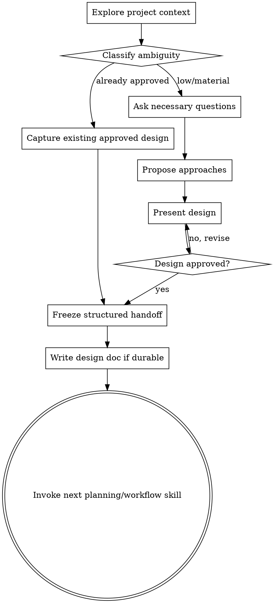

> **Supremepower:** Generated from Cursor-enhanced superpowers. Same methodology; load skills via the extension (for example `/skills:name` or extension UI).

# Brainstorming Ideas Into Designs

## Overview

Turn ideas into explicit, reviewable designs before implementation or irreversible/expensive creative execution.

Start by understanding the current project context and authoritative artifacts. Resolve ambiguity, compare approaches, freeze the chosen design, then hand the design to the next workflow without forcing that workflow to reconstruct decisions from chat.

<HARD-GATE>
Do NOT invoke an implementation skill, write code, scaffold a project, spend provider credits, or begin irreversible/expensive creative production while material design choices remain unresolved.

A design gate is already satisfied when the user has explicitly approved the relevant design in the current context. Do not ask them to approve the same thing again merely to satisfy ceremony.
</HARD-GATE>

## Ambiguity Gate

Before deciding how much brainstorming is needed, classify the task:

### A. Design already approved

The user has already selected the approach, supplied an approved spec, or explicitly says to implement a previously presented design.

Action: preserve the approved design as the handoff and move to `writing-plans` or the applicable execution skill. Do not reopen settled decisions unless new evidence conflicts with them.

### B. Low ambiguity

The desired outcome and constraints are clear, with only small implementation choices remaining.

Action: use a compact design, often a few paragraphs or a short decision table, then obtain approval if it has not already been granted.

### C. Material ambiguity

Architecture, user experience, creative direction, canon, provider strategy, output format, rights constraints, or success criteria can reasonably lead to different solutions.

Action: run the full workflow below.

This preserves the original discipline without creating approval loops for work the user has already authorized.

## Anti-Pattern: "This Is Too Simple To Need A Design"

Every change benefits from making assumptions visible. A todo list, a single-function utility, a config change, a storyboard, or a provider workflow can all fail because an unstated choice was wrong.

The design can be tiny when the ambiguity is tiny. The point is not document volume. The point is explicit decisions.

## Checklist

Create a task for each applicable item and complete them in order:

1. **Explore project context** — files, docs, recent commits, connected sources, existing canon/approved artifacts.
2. **Classify ambiguity** — approved, low, or material.
3. **Identify authoritative inputs** — distinguish source truth from references and inference.
4. **Ask only necessary clarifying questions** — one at a time; skip questions already answered by context or sources.
5. **Propose 2–3 approaches when a real choice exists** — include trade-offs and recommendation.
6. **Present the design** — architecture, components, data flow, failure modes, verification, and relevant creative/canon constraints.
7. **Obtain or recognize approval** — explicit approval may already exist in the conversation.
8. **Freeze a design handoff** — intent, approach, constraints, invariants, sources, outputs, unresolved items, verification.
9. **Write a design doc when durable documentation is warranted** — normally `docs/plans/YYYY-MM-DD-<topic>-design.md`.
10. **Transition to implementation** — invoke `writing-plans` for software/system work, or the approved domain workflow when the design itself is the required handoff.

## Process Flow



## Understanding the Idea

Start by inspecting the project state before interrogating the user.

Look for:

- existing design docs and plans
- recent commits and open work
- schemas/contracts already in use
- prior decisions in connected sources
- approved canon, identity, reference, or style artifacts
- constraints already stated by the user
- evidence of partial implementation that changes the design space

Ask questions only when the answer materially changes the design and cannot be resolved from available evidence.

Prefer one question per message in interactive sessions, but do not manufacture questions when the task is already sufficiently specified.

Focus on:

- purpose and target user/audience
- constraints and non-goals
- success criteria
- source-of-truth artifacts
- compatibility requirements
- budget/latency/provider constraints if execution is involved
- rights/license requirements where relevant
- failure and recovery expectations
- what must remain unchanged

## Authoritative Inputs vs Inference

For complex or creative systems, label the role of important inputs:

```yaml
inputs:
  authoritative:
    - approved canon
    - current schema
    - user-selected design
  references:
    - moodboards
    - competitor examples
    - upstream docs
  inferred:
    - proposed architecture
    - derived visual motif
```

Do not silently replace an authoritative value with a newly inferred one because the inferred value seems cleaner.

## Exploring Approaches

Propose 2–3 approaches only when there are genuinely different viable choices.

For each meaningful approach, compare relevant dimensions such as:

- complexity
- extensibility
- migration cost
- compatibility
- maintainability
- provider lock-in
- reproducibility
- creative control
- rights/licensing risk
- failure recovery
- testing/verification burden

Lead with the recommended option and explain why it best fits the user's stated goals and existing architecture.

When there is only one sensible approach because the user already constrained the design, state that instead of inventing fake alternatives.

## Presenting the Design

Scale the design to the task. Cover only relevant sections, typically:

- objective and non-goals
- architecture / major components
- data or artifact flow
- stable identities and source-of-truth boundaries
- tool/provider boundaries
- error handling, retries, and checkpoints
- security/rights/license constraints
- migration or compatibility implications
- testing/evaluation/verification
- acceptance criteria

For creative workflows also cover as applicable:

- canon/identity anchors
- reference roles
- visual or sonic language
- scene/shot abstraction boundaries
- continuity requirements
- revision strategy
- approval gates
- publishing/release constraints

## Freeze the Design Handoff

After approval, create a compact handoff that the next skill can consume directly.

Use this shape when practical:

```yaml
handoff:
  from_skill: brainstorming
  to_skill: writing-plans
  intent: ""
  approved_approach: ""
  constraints: []
  protected_invariants: []
  source_artifacts: []
  required_outputs: []
  unresolved_questions: []
  verification_requirements: []
```

Change `to_skill` to the actual domain workflow when appropriate.

For long-running work, also record the current checkpoint and any already-completed artifacts.

The shared conventions live in `docs/SKILL_WORKFLOW_CONTRACT.md`.

## After the Design

### Documentation

Write the validated design to `docs/plans/YYYY-MM-DD-<topic>-design.md` when the design is durable project knowledge, especially for:

- architecture changes
- cross-repository contracts
- migrations
- new workflows
- provider/tool integrations
- non-trivial creative pipelines

Use `elements-of-style:writing-clearly-and-concisely` if available.

A tiny one-off change does not need a ceremonial document if the approved handoff is sufficient and project conventions do not require one.

### Implementation

For software/system implementation, invoke `writing-plans` next.

For a creative workflow whose design is already executable as a domain contract, invoke that approved domain skill next, for example `creative/music-to-video` after its visual direction has been approved.

Do not skip the handoff. The next skill should inherit decisions rather than rediscover them.

## Key Principles

- **Evidence before questions** — inspect available context first.
- **Do not re-ask answered questions** — existing explicit user decisions count.
- **One question at a time when clarification is needed** — reduce cognitive load.
- **YAGNI ruthlessly** — remove unnecessary scope.
- **Explore real alternatives** — not fake choice theater.
- **Incremental validation** — validate material design decisions before expensive execution.
- **Preserve source truth** — inference does not silently override canon/specs.
- **Freeze decisions for handoff** — continuation should not depend on chat archaeology.
- **Separate workflow from provider** — define semantic intent before choosing an executor.
- **Be flexible** — revisit the design when new evidence invalidates a prior assumption.
