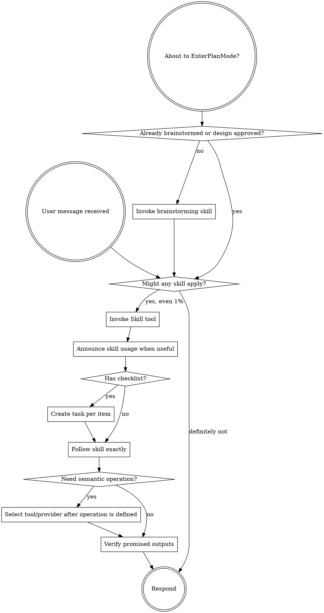

> **Core library copy:** Same behavioral content as `skills/using-superpowers/SKILL.md` for consumers that load from `core/skills/`; includes `references/` beside this file.

<SUBAGENT-STOP>
If you were dispatched as a subagent to execute a specific task, skip this skill unless the parent explicitly asks you to perform skill discovery.
</SUBAGENT-STOP>

## Innate Workflow Bridge

When `innate-workflow` is available, treat it as the session-level rhythm around this skill: audit the workspace, use `using-superpowers` to select relevant skills, do the task work, then update memory when appropriate. This skill remains the authority for skill selection; `innate-workflow` is the surrounding loop.

<EXTREMELY-IMPORTANT>
If you think there is even a 1% chance a skill might apply to what you are doing, you ABSOLUTELY MUST invoke the skill.

IF A SKILL APPLIES TO YOUR TASK, YOU DO NOT HAVE A CHOICE. YOU MUST USE IT.

This is not negotiable. This is not optional. You cannot rationalize your way out of this.
</EXTREMELY-IMPORTANT>

## Instruction Priority

Superpowers skills override default system prompt behavior, but **user instructions always take precedence**:

1. **User's explicit instructions** (AGENTS.md, GEMINI.md, direct requests) — highest priority
2. **Superpowers skills** — override default system behavior where they conflict
3. **Default system prompt** — lowest priority

If user/project instructions say "don't use TDD" and a skill says "always use TDD," follow the user's instructions. The user is in control.

## How to Access Skills

**In Codex:** Use the `Skill` tool. When you invoke a skill, its content is loaded and presented to you. Follow it directly. Never use the Read tool on skill files when the Skill tool is available.

**In Copilot CLI:** Use the `skill` tool. Skills are auto-discovered from installed plugins.

**In Gemini CLI:** Skills activate via the `activate_skill` tool. Gemini loads skill metadata at session start and activates the full content on demand.

**In Supremepower/Gemini extension hosts:** Use extension skill/command loading (for example `/skills:name` or the extension UI).

**In other environments:** Check the platform's documented skill-loading mechanism. If no first-class loader exists, use the repository's canonical skill file without inventing a different workflow.

## Platform Adaptation

Skills use Codex-oriented tool names in places. Non-CC platforms: see `references/copilot-tools.md`, `references/codex-tools.md`, and `references/gemini-tools.md` for equivalents.

# Using Skills

## The Rule

**Invoke relevant or requested skills BEFORE any response or action.** Even a 1% chance a skill might apply means that you should invoke the skill to check. If an invoked skill turns out to be wrong for the situation, you don't need to continue using it.

Tool availability is not a reason to skip skill discovery. Having a GitHub connector, image generator, MCP server, shell, browser, provider API, or local workflow tells you what can execute, not how the task should be reasoned about.

## Skill Routing Is Not Provider Routing

Keep these decisions separate:

```text
user intent
  -> skill discovery
  -> process/domain workflow
  -> semantic operation(s)
  -> tool / MCP binding
  -> provider or local backend
  -> artifacts + provenance
  -> verification
```

- **Skill routing** selects the reasoning/process discipline.
- **Workflow routing** selects the ordered semantic operations and gates.
- **Tool routing** selects an available interface capable of the operation.
- **Provider routing** selects the concrete local or hosted executor.

Never jump directly from user intent to a provider merely because the provider is available.

For cross-system workflows, use the shared conventions in `docs/SKILL_WORKFLOW_CONTRACT.md` when applicable.

## Selection Record for Complex Work

For multi-step, cross-repository, creative-production, research-heavy, or multi-provider work, keep a lightweight selection record in the working plan or handoff:

```yaml
skill_selection:
  intent: "what the user is trying to accomplish"
  process_skills: []
  domain_skills: []
  implementation_skills: []
  verification_skills: []
  semantic_capabilities: []
  provider_decisions_deferred: []
```

This does not need to be shown to the user unless useful. Its purpose is to prevent silent skill/tool/provider conflation and make continuation easier for another agent.

## Interaction Rhythm

Use this compact rhythm for real conversations:

- `User asks -> check for applicable skills -> invoke skill`
- `Skill loaded -> announce usage briefly when useful -> execute checklist/flow`
- `Blocked -> gather missing evidence -> continue flow`
- `Cross-skill handoff -> preserve intent, constraints, artifacts, invariants, unresolved questions`
- `Provider needed -> choose only after semantic operation is defined`
- `Flow complete -> verify outputs/tests/artifacts -> respond with result`

For implementation-heavy requests, keep this higher-order rhythm when applicable:

- `brainstorming -> writing-plans -> test-driven-development -> requesting-code-review -> verification-before-completion -> finishing-a-development-branch`

For creative-production requests, a common rhythm is:

- `brainstorming or creative-ideation -> domain creative skill -> structured asset/render workflow -> evaluation -> verification-before-completion`

For research-heavy requests, prefer the relevant research/evidence skill before domain execution.

Never skip the first transition (`request -> skill check`) even when the request seems simple.



## Handoff Discipline

When one skill transitions to another, do not make the next skill reconstruct the state from chat if structured state already exists.

Preserve as applicable:

- user intent and success criteria
- approved approach/design
- constraints and protected invariants
- source files/artifacts and stable IDs
- decisions already made
- unresolved questions
- required outputs
- verification requirements
- current checkpoint and partial failures

Use the handoff envelope in `docs/SKILL_WORKFLOW_CONTRACT.md` for complex workflows.

## Red Flags

These thoughts mean STOP because you're rationalizing:

| Thought | Reality |
|---------|---------|
| "This is just a simple question" | Questions are tasks. Check for skills. |
| "I need more context first" | Skill check comes BEFORE clarifying questions. |
| "Let me explore the codebase first" | Skills tell you HOW to explore. Check first. |
| "I can check git/files quickly" | Files lack conversation context. Check for skills. |
| "Let me gather information first" | Skills tell you HOW to gather information. |
| "This doesn't need a formal skill" | If a skill exists, use it. |
| "I remember this skill" | Skills evolve. Read current version. |
| "This doesn't count as a task" | Action = task. Check for skills. |
| "The skill is overkill" | Simple things become complex. Use it. |
| "I'll just do this one thing first" | Check BEFORE doing anything. |
| "The provider already has a tool for this" | Tool/provider availability is not process selection. |
| "The MCP can decide the creative direction" | Execution interfaces do not own creative intent. |
| "The previous agent probably handled continuity" | Preserve and inspect handoff state instead of assuming. |
| "This feels productive" | Undisciplined action wastes time. Skills prevent this. |
| "I know what that means" | Knowing the concept is not using the skill. Invoke it. |

## Skill Priority

When multiple skills could apply, use this order:

1. **Meta/process skills first** (using-superpowers, brainstorming, debugging, research discipline) because these determine HOW to approach the task.
2. **Domain skills second** (creative workflows, publishing, architecture, security) because these encode domain reasoning.
3. **Implementation/execution skills third** (frontend-design, MCP builders, provider/local execution) because these perform the work.
4. **Verification/finishing skills last** because they prove and package the result.

Examples:

- "Let's build X" -> brainstorming first, then writing/implementation skills.
- "Fix this bug" -> debugging first, then domain-specific skills.
- "Turn this finished song into a video" -> `music-to-video`, plus brainstorming first only if visual direction is unresolved.
- "Generate 40 reproducible assets from these approved specs" -> `structured-asset-pipeline`, not a fresh creative ideation loop unless the specs themselves are unresolved.

## Skill Types

**Rigid** (TDD, debugging, verification): Follow exactly. Don't adapt away discipline.

**Flexible** (patterns, creative methods): Adapt principles to context while preserving explicit invariants and user-approved constraints.

The skill itself tells you which.

## User Instructions

Instructions say WHAT and may also constrain HOW. "Add X" or "Fix Y" doesn't automatically mean skip workflows, but an explicit user decision can satisfy a workflow gate. Do not ask the user to re-approve a design they already approved or repeat information they already provided.
